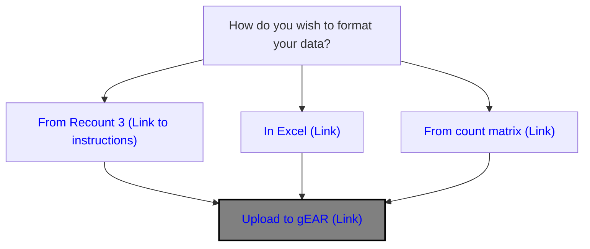
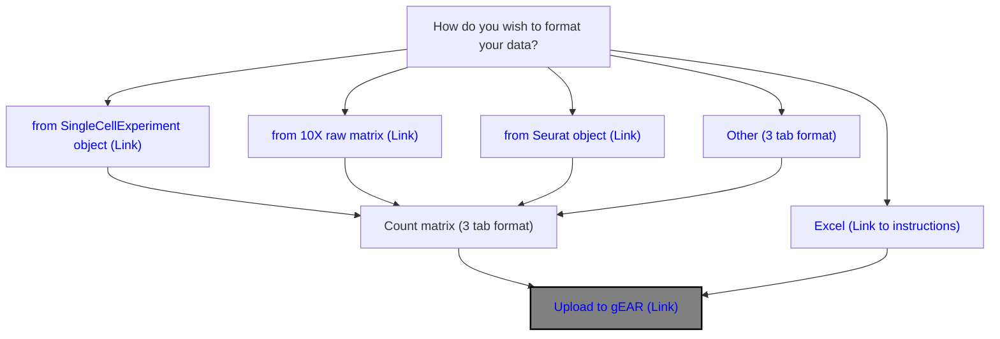
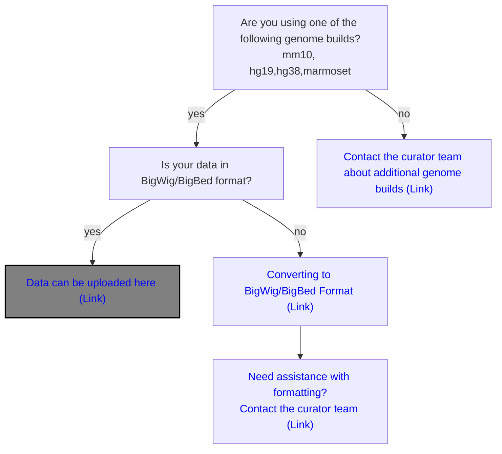

# Welcome to the gEAR upload documentation!

The gene Expression Analysis Resource platform currently supports the upload of:

- Bulk RNASeq data
- Single-Cell Sequencing data
- Microarray data
- Epigenetic data

To assist users with uploading their data, we maintain documentation for
uploading data from several different starting formats including programmatically generated files or through Excel. To find the documentation
best suited for your upload needs, please see the links below. If you have any questions, or would like assistance with uploading please contact the curator team [(Contact us)](https://umgear.org/contact.html).

## Bulk RNAseq data

Bulk RNAseq data can be uploaded to gEAR through three paths (from Recount3 data, through Excel or via tab-deliminated files). In addition to the data files, every submission requires a standard metatdata template to be filled out with basic information about your dataset. A blank template form can be found on the upload page or linked [here](https://umgear.org/user_templates/metadata_template.xlsx).

> [!NOTE]
> Count files must be normalized prior to upload, any common normalization method is accepted

> [!TIP]
> To open the links in the flowchart, right click and choose open in new window otherwise link will show as blocked

- [Preparing bulk RNAseq data using code (overview slides)](https://docs.google.com/presentation/d/1lYbgACVi-931EHTGNIw1bSZWIIUBcg3o/edit?usp=sharing&ouid=102015920709954238045&rtpof=true&sd=true)
  - [Preparing bulk RNAseq data (R code)](https://github.com/IGS/gEAR/wiki/Prepare-3-tab-format-for-RNAseq-dataset-uploading)
  - [Preparing RNAseq data from Recount 3 (R code)](https://github.com/songeric1107/Host_data_on_gEAR/blob/225e61631db4f0a60acb3abdb90ba55ace814e87/script/prepare_from_recount3.md)
- [Preparing bulk RNAseq data via Excel (slides)](https://docs.google.com/presentation/d/1lU7wqWmeW907GBGfK0oBi06hcrvra-PY/edit?usp=sharing&ouid=102015920709954238045&rtpof=true&sd=true)
- [Example upload files](https://drive.google.com/drive/folders/1OYZ7-FjgTBwNrZDqBI3dAA7bv8QmwFE-?usp=sharing)

## Single Cell RNAseq

Single cell sequencing data can be uploaded to gEAR through multiple paths. The most common path for data upload is creating three tab-deliminated text files which are compressed together for upload, but other upload methods are avialable.  In addition to the data files, every submission requires a standard metatdata template to be filled out with basic information about your dataset. A blank template form can be found on the upload page or linked [here](https://umgear.org/user_templates/metadata_template.xlsx).

> [!NOTE]
> Count files must be normalized prior to upload, any common normalization method is accepted

> [!TIP]
> To open the links in the flowchart, right click and choose open in new window otherwise link will show as blocked

- [Preparing single cell data via code (slides)](https://docs.google.com/presentation/d/1_YlLlQCXobkfjtIQddSZBuOo8iz3Tgnf/edit?usp=sharing&ouid=102015920709954238045&rtpof=true&sd=true)
  - [Preparing single cell data (R code)](https://github.com/IGS/gEAR/wiki/Uploading-Single-Cell-Sequencing-data)
- [Preparing single cell data via Excel (slides)](https://docs.google.com/presentation/d/1ptk78OJAQJnyRKe3Gkejqa43Vh-cP21h/edit?usp=sharing&ouid=102015920709954238045&rtpof=true&sd=true)
- Example files
  - [Processed scRNA files](https://drive.google.com/drive/folders/1LHhhCIV5LmYspjfHccYr-gD1kW-bswut?usp=sharing)
  - [Raw scRNA matrix](https://drive.google.com/drive/folders/1c6pjqj-oruNeSsYDoZtJbZv-nEmF0bcT?usp=sharing)

## Microarray data

- [Prepare GEO microarray data for upload](https://github.com/songeric1107/Host_data_on_gEAR/blob/225e61631db4f0a60acb3abdb90ba55ace814e87/script/GEO_microarray_data_to_gEAR.R)

## Spatial data

> [!NOTE]
> This is still a work in progress

Spatial transcriptomic data from various platforms can be uploaded to gEAR. When you are in the file upload step within the uploader tool, select a platform in the dropdown under the "Spatial" category to let gEAR know what type of data to expect. Most file uploads will be a tarball with a ".tar.gz" extension, and upon selecting a platform, you can view the requirements for the tarball contents and format.

Currently supported platforms:

- Curio Seeker
- GeoMx DSP
- 10x Genomics Visium
- 10x Genomics Visium HD
- 10x Genomics Xenium

If you are interested in uploading spatial transcriptomic data from a platform that is not in the above list, it is recommended to follow the instructions for the Single Cell RNAseq section. As long as your metadata includes the spatial row and column (X and Y) coordinates, then those can be selected in various dataset curation plots.

## Epigenetic data (Gosling)

> [!NOTE]
> This is still a work in progress as Epiviz has been sunsetted and Gosling is the replacement viewer

Epigenetic data are uploaded and displayed using integration with the Gosling epigenome viewer. If your data are already in BigWig/BigBed format they can be uploaded via URL or through standard file uploads. Epigenetic uploads do not currently require a seperate metadata file (in contrast to Bulk RNAseq or Single cell data).

> [!TIP]
> To open the links in the flowchart, right click and choose open in new window otherwise link will show as blocked

- [Uploading epigenetic data to gEAR (slides)](https://docs.google.com/presentation/d/1T9pusgKx4bgR_pf0DTKQfnmpmfxF0KbR/edit?usp=sharing&ouid=102015920709954238045&rtpof=true&sd=true)
  - [Preparing BigWig/BigBed files from narrow peak files (R code)](https://github.com/songeric1107/Host_data_on_gEAR/blob/225e61631db4f0a60acb3abdb90ba55ace814e87/script/epiviz_data_prep.md)

