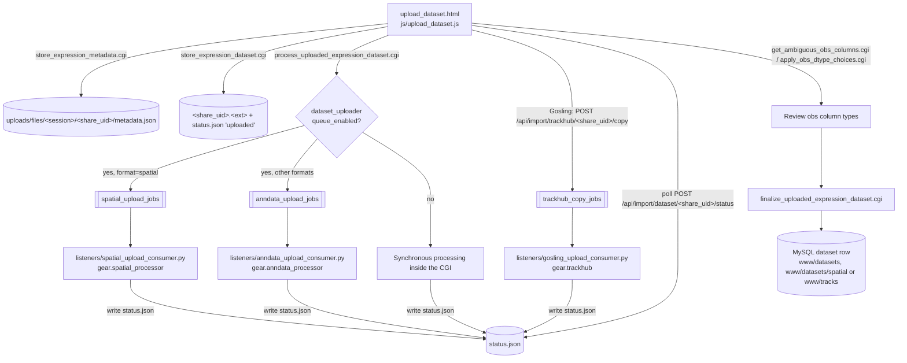

# Dataset Upload Pipeline

This page follows a dataset from the upload form in the browser through staging, background processing and finalization into its permanent place under `www/`. It was written from the code in `www/js/upload_dataset.js`, `www/cgi/`, `www/api/resources/`, `lib/gear/` and `listeners/`.

Related docs: [API reference](./api_reference.md), [configuration](./configuration.md), [code map](./code_map.md), [RabbitMQ consumers](./services/rabbitmq_consumers.md), [RabbitMQ setup](./setup/rabbitmq.md), [spatial service](./services/spatial.md), [admin/maintenance scripts](../misc/scripts/README.md).

## Overview

Everything for an upload in progress lives in one staging directory, `www/uploads/files/<session_id>/<share_uid>/`. The browser creates `dataset_uid` (long GUID) and `share_uid` (short GUID) on page load (`initPage()`). Staged files are named after `share_uid`, and finalized files after `dataset_uid`.

## Frontend: steps and calls

`www/upload_dataset.html` holds a stepper whose step IDs are `step-<label>`. `stepTo()` in `www/js/upload_dataset.js` walks them in this order: `enter-metadata`, `upload-dataset`, `build-trackhub` (Gosling only), `process-dataset`, `post-process-dataset`, `finalize-dataset`, `curate-dataset`.

| Step | JS function(s) | Backend call | Notes |
| --- | --- | --- | --- |
| Page load | `initPage()`, `loadUploadsInProgress()` | `cgi/get_uploads_in_progress.cgi` | Lists unfinished uploads. The resume button calls `stepTo(upload.load_step)`. |
| Page load (delete) | `deleteUploadInProgress()` | `cgi/delete_upload_in_progress.cgi` | Removes the staging directory. |
| enter-metadata (optional spreadsheet) | `populateMetadataFormFromFile()` → `apiCallsMixin.parseMetadataFile()` (`www/js/common.v2.js`) | `cgi/upload_expression_metadata.cgi` | Parses an Excel metadata sheet and pre-fills the form. |
| enter-metadata (optional GEO lookup) | `getGeoData()` → `apiCallsMixin.fetchGeoData()` | `cgi/get_metadata_from_geo.cgi` | Fills contact, organism and library fields from a GEO ID. |
| enter-metadata (submit) | `validateMetadataForm()`, `storeMetadata()` | `cgi/store_expression_metadata.cgi` | Goes to `upload-dataset` if it succeeds. |
| upload-dataset | `selectDatasetFormat()`, `uploadDataset()` (XHR with a progress bar) | `cgi/store_expression_dataset.cgi` | Formats are `mex_3tab`, `excel`, `rds`, `h5ad`, `spatial` (plus a platform choice) and `gosling`. When the upload succeeds, it calls `processDataset()` and switches to `process-dataset` after 3 s. |
| upload-dataset → processing | `processDataset()` | `cgi/process_uploaded_expression_dataset.cgi` | Queues the job, or processes synchronously when the queue is disabled. |
| build-trackhub (Gosling) | `buildTrackhub()`, `populateHubAndTracks()`, `stageTrackHub()` | `POST api/import/trackhub/<share_uid>/copy` | Parses a hub URL or `hub.txt` into `HubContainer`/`TrackContainer` (`www/js/classes/trackhub.js`), then uploads the hub JSON, track stanzas and track files. |
| process-dataset | `checkDatasetProcessingStatus()` or `checkTrackhubStatus()`, polled every 10 s | `POST api/import/dataset/<share_uid>/status` | Polling stops at `complete` or `error`. |
| post-process-dataset | `renderPostProcessingOptions()`, `renderAmbiguousObsColumns()` | `cgi/get_ambiguous_obs_columns.cgi` | If nothing needs review (`reviewed` is true), the step is skipped. |
| post-process-dataset (submit) | `applyPostProcessingOptions()`, `applyAmbiguousObsColumns()` | `cgi/apply_obs_dtype_choices.cgi` | Sends the categorical/continuous choice for each flagged column. |
| finalize-dataset | `finalizeUpload()` → `apiCallsMixin.finalizeExpressionUpload()` | `cgi/finalize_uploaded_expression_dataset.cgi` | Updates checkboxes from `metadata_loaded`, `h5ad_migrated`, `userdata_migrated` and `primary_analysis_migrated`. |
| curate-dataset | Button handlers | none | Opens `dataset_curator.html?dataset_id=<dataset_uid>` or `./p?s=<share_uid>&gsem=1`. Gosling uploads get a "no curation" panel instead. |

For Gosling, `adjustUIForGosling()` hides the file-upload panel and shows the `build-trackhub` step. The Gosling path never calls `store_expression_dataset.cgi` or `process_uploaded_expression_dataset.cgi`.

## CGIs and API endpoints

All CGIs live in `www/cgi/` and return JSON. The staging directory is `S = www/uploads/files/<session_id>/<share_uid>/`.

| Endpoint | Called at step | Purpose | Key params | Writes |
| --- | --- | --- | --- | --- |
| `get_uploads_in_progress.cgi` | Page load | Lists every subdirectory of `uploads/files/<session_id>/` and works out `status` and `load_step` from `metadata.json`, `status.json`, the presence of `<share_uid>.tar.gz`, and `questionable_obs_columns`/`obs_dtype_reviewed`. | `session_id` | none |
| `delete_upload_in_progress.cgi` | Page load | Deletes `S` recursively, after checking that the path stays inside `uploads/files`. | `session_id`, `share_uid`, `dataset_id` | removes `S` |
| `upload_expression_metadata.cgi` | enter-metadata | Accepts `.xls`/`.xlsx`, saves it, parses it with `gear.metadata.Metadata` (best-effort `populate_from_geo()`), and returns the parsed metadata. Nothing is stored permanently. | `session_id`, `metadata-dataset-id`, `metadata-file-input` | `/tmp/<dataset_id>.xlsx` |
| `get_metadata_from_geo.cgi` | enter-metadata | Looks up GEO metadata. | `geo_id` | none |
| `store_expression_metadata.cgi` | enter-metadata | Saves the form fields to JSON, using legacy key names such as `annotation_release_number`, `geo_accession` and `sample_taxid`. Also adds `perform_primary_analysis=false` and `dataset_format=""`. | `session_id`, `share_uid`, `dataset_uid`, `title`, `summary`, `dataset_type`, `taxon_id`, `organism`, ... `user_pii_affirmed` | `S/metadata.json` |
| `store_expression_dataset.cgi` | upload-dataset | Streams the upload to disk, checks the extension against `dataset_format`, and for spatial checks that `spatial_format` is in `SPATIALTYPE2CLASS`. Deletes the file and returns an error if the size differs from `expected_size`. | `session_id`, `share_uid`, `dataset_format`, `spatial_format`, `expected_size`, `dataset_file` | `S/<share_uid>.<ext>`, `S/status.json` (`status: "uploaded"`) |
| `process_uploaded_expression_dataset.cgi` | upload-dataset → processing | Creates a `job_id` (UUID) and writes `status: "queued"`. Sets `perform_primary_analysis` in `metadata.json` (true when `dataset_type` is `single-cell-rnaseq` or `spatial` and `dataset_format != "spatial"`) and records `dataset_format`. Then publishes to RabbitMQ or processes synchronously (see below). | `session_id`, `share_uid`, `dataset_format`, `spatial_format` | `S/status.json`, `S/metadata.json`. Returns 202 when queued, 200/500 when synchronous. |
| `POST /api/import/trackhub/<share_uid>/copy` (`www/api/resources/track_hub.py`, `TrackHubCopy`) | build-trackhub | Saves the uploaded track files into `S`, sets `dataset_format="gosling"` in `metadata.json`, and publishes to `trackhub_copy_jobs`. If the queue is disabled, it calls `gear.trackhub.process_trackhub_synchronously()` instead. | form: `hub_json`, `tracks`, `assembly`, `dry_run`, `tracks[<id>][file]` files; cookie `gear_session_id` | `S/status.json` (with track counters), track files in `S` |
| `POST /api/import/dataset/<share_uid>/status` (`www/api/resources/dataset_processing.py`, `DatasetProcessingStatus`) | process-dataset | Returns the contents of `S/status.json`. Forces `progress` to 100 on `complete`. While `processing` (and not Gosling), it checks for a `job_id` and falls back to a legacy `process_id` check with `ps`. | JSON `dataset_format`; cookie `gear_session_id` | none |
| `get_ambiguous_obs_columns.cgi` | post-process-dataset | Returns `questionable_obs_columns` and `obs_dtype_reviewed` from `metadata.json`. Does not open the H5AD or Zarr. | `session_id`, `share_uid` | none |
| `apply_obs_dtype_choices.cgi` | post-process-dataset | Applies `gear.utils.obs.apply_obs_dtype_choices()` to `obs`. For H5AD it uses `H5adAdapter(...).get_adata(backed=True)` then `adata.write()`. For spatial it uses `ZarrAdapter`, then `adata.write_zarr(<zarr>/tables/table)`. Then sets `obs_dtype_reviewed=true` and clears the flagged list. | `session_id`, `share_uid`, `choices` (JSON) | `S/<share_uid>.h5ad` or `.zarr`, `S/metadata.json` |
| `finalize_uploaded_expression_dataset.cgi` | finalize-dataset | Runs `Metadata.make_spatial_h5ad_adjustment()` and `Metadata.save_to_mysql(status='completed', is_public=...)`, moves files into place (see [On-disk layout](#on-disk-layout)), adds a default curation for spatial (`geardb.add_spatial_panel_curation`) or Gosling (`geardb.add_gosling_display_curation`), and deletes `S`. | `session_id`, `share_uid`, `dataset_uid`, `dataset_format`, `dataset_visibility` (`public`/`private`), `perform_analysis_migration` | MySQL `dataset` row, `www/datasets/...`, `www/tracks/<dataset_id>/` |
| `check_dataset_processing_status.cgi` | not called by `upload_dataset.js` | Older CGI version of the status endpoint, kept for checking an upload's status by hand: it takes `session_id` as a plain parameter, so it is easier to call with curl than the cookie-based API route (see below). Reads `status.json` and runs the legacy `process_id` check. | `session_id`, `share_uid` | none |

`get_h5ad_obs_columns.cgi` also exists in `www/cgi/`, but the uploader does not call it.

### RabbitMQ publish and synchronous fallback

`process_uploaded_expression_dataset.cgi` reads `[dataset_uploader] queue_enabled` and `queue_host` from `gear.ini`:

- Queue enabled: it opens `gearqueue.Connection(host=..., publisher_or_consumer="publisher")` and publishes one of two messages:
  - `spatial_upload_jobs` with `{job_id, share_uid, spatial_format, perform_primary_analysis}` (`queue_spatial_job`)
  - `anndata_upload_jobs` with `{job_id, share_uid, dataset_uid, dataset_format, perform_primary_analysis}` (`queue_anndata_job`)
- Queue disabled: `queue_*_job` raises `QueueDisabledError`, and the CGI calls `gear.spatial_processor.process_spatial_synchronously()` or `gear.anndata_processor.process_anndata_synchronously()` in the Apache worker. The request stays open until processing finishes. To keep memory use bounded, the CGI calls `set_memory_limit_from_cgroup()` at import time.
- Queue enabled but unreachable: a connection or publish failure is *not* treated as disabled. The CGI returns HTTP 500 and `status.json` stays at `queued`.

`TrackHubCopy` follows the same pattern for `trackhub_copy_jobs`. It passes the `[higlass]` settings to the synchronous fallback.

## RabbitMQ consumers

Setup, systemd installation, scaling and log locations are covered in [RabbitMQ consumers](./services/rabbitmq_consumers.md) and [RabbitMQ setup](./setup/rabbitmq.md). This is a summary for the upload pipeline:

| Queue | Publisher | Consumer | Processing code | systemd | Dockerfile |
| --- | --- | --- | --- | --- | --- |
| `anndata_upload_jobs` | `www/cgi/process_uploaded_expression_dataset.cgi` | `listeners/anndata_upload_consumer.py` | `gear.anndata_processor.AnndataProcessor` | `anndata-upload-consumer@.service` / `.target` (2 workers) | `listeners/Dockerfile.anndata_upload` |
| `spatial_upload_jobs` | `www/cgi/process_uploaded_expression_dataset.cgi` | `listeners/spatial_upload_consumer.py` | `gear.spatial_processor.process_spatial_synchronously` | `spatial-upload-consumer@.service` / `.target` (2) | `listeners/Dockerfile.spatial_upload` |
| `trackhub_copy_jobs` | `www/api/resources/track_hub.py` | `listeners/gosling_upload_consumer.py` | `gear.trackhub.TrackHubProcessor` | `gosling-upload-consumer@.service` / `.target` (3) | `listeners/Dockerfile.gosling_upload` |
| `projectr` (not part of uploads) | `www/api/resources/projectr.py` | `listeners/projectr_consumer.py` | projectR | `projectr-consumer@.service` / `.target` (3) | `listeners/Dockerfile.projectr` |

The unit files are in `systemd/`. `gear-consumers.target` groups all four targets, and every worker runs in `gear-consumers.slice`. Each unit's `ExecStart` is `/opt/bin/python3 <gear_root>/listeners/<consumer>.py`. The Dockerfiles are built from the gEAR root, and `Dockerfile.python_base` is the shared base image.

Behavior shared by the upload consumers:

- **Locating the staging directory.** The message carries only `share_uid`. The consumer scans `www/uploads/files/*/` for a `<share_uid>` subdirectory.
- **Duplicate-delivery guard (anndata, spatial).** `gear.utils.job_coordination.try_acquire_lock_file(S/.job.lock)` takes a non-blocking `flock`. If another worker already holds the lock, the consumer acks and drops the redelivered message.
- **Retry bound (anndata, spatial).** `check_and_record_attempt(S, max_attempts=MAX_JOB_ATTEMPTS)` keeps a counter in `S/.attempt_count` (`MAX_JOB_ATTEMPTS = 2`). Once the limit is reached, the job gets `status: "error"` and the message is nacked without requeue. `clear_attempt_count()` runs after a success.
- **Memory ceiling.** `main()` calls `set_memory_limit_from_cgroup()`, so running out of memory raises a catchable `MemoryError` instead of triggering a SIGKILL.
- **Logging.** Consumers append to `/var/log/gEAR_queue/<queue_name>.log` via `log_line()`.
- **Failure handling.** Errors are nacked with `requeue=False`. The processors write the user-facing error into `status.json` themselves.

### status.json conventions

`S/status.json` is the only channel between the processing code and the browser.

| Writer | Keys | `status` values |
| --- | --- | --- |
| `store_expression_dataset.cgi` | `job_id` (null), `status`, `message`, `progress` | `uploaded` |
| `process_uploaded_expression_dataset.cgi` | `job_id` (UUID), `status`, `message`, `progress` | `queued` |
| `gear.anndata_processor` (`write_status`, `_update_progress`, `_update_status`) | same | `processing` → `complete` or `error` |
| `gear.spatial_processor` | same; `progress` moves forward through 7 named steps | `processing` → `complete` or `error` |
| `gear.trackhub.write_status` / `TrackHubProcessor.update_status` | adds `completed_tracks`, `total_tracks`, `track_statuses` (per track: `downloading`, `downloaded`, `converting`, `ingesting`, `completed`) | `queued` → `processing` → `complete` or `error` |

Older uploads may carry a `process_id` instead of a `job_id`. Both status endpoints check that PID with `ps -p`.

## Processing libraries

| Module | Role in the pipeline |
| --- | --- |
| `lib/gear/anndata_processor.py` | `AnndataProcessor.process()` dispatches on `dataset_format`. **`h5ad`:** reads in backed mode, sanitizes `obs`, maps Ensembl IDs if `var` has no `gene_symbol`, and rewrites with gzip. **`mex_3tab`:** extracts `<share_uid>.tar.gz` or `.zip`, then uses `package_content_type()` to detect 3-tab (`expression.tab`/`genes.tab`/`observations.tab`, or the NeMO names `DataMTX.tab`/`ROWmeta.tab`/`COLmeta.tab`) or MEX (`matrix.mtx`/`barcodes.tsv`/`genes.tsv`, or the gzipped Cell Ranger v3+ set `matrix.mtx.gz`/`barcodes.tsv.gz`/`features.tsv.gz`, optionally inside a folder), which `_process_mex()` reads with `scanpy.read_10x_mtx()`, keeping Ensembl IDs as the `var` index and renaming `gene_symbols` to `gene_symbol`. **`excel`:** reads sheets `expression`, `observations` and `genes`. **`rds`:** hands off to `seuratuploader`. When `perform_primary_analysis` is set, it then calls `gear.primary_analysis.add_primary_analysis_to_dataset()`, which writes `S/analysis_pipeline.json` and the preliminary QC plots. `_sanitize_and_flag_obs_columns()` stores `questionable_obs_columns` and `obs_dtype_reviewed` in `metadata.json`. Output is `S/<share_uid>.h5ad`. |
| `lib/gear/seuratuploader.py` | `seurat_to_anndata()` uses rpy2 to load a Seurat RDS in R and convert it to AnnData. Helpers: `genes_to_ensembl()`, `reduction_to_metadata()` (copies reduction coordinates into `obs`), `layer_to_X()`. Can also run as a script. |
| `lib/gear/spatialhandler.py` | `SpatialHandler` base class plus `CosMxHandler`, `CurioHandler`, `GeoMxHandler`, `VisiumHandler`, `VisiumHDHandler` and `XeniumHandler`, which read a platform `.tar.gz` into a SpatialData object. `SPATIALTYPE2CLASS` maps the keys `cosmx`, `curio`, `geomx`, `visium`, `visium_hd`/`visiumhd` and `xenium`. `ORG_ID_REQ_TYPES` (`cosmx`, `curio`, `geomx`) need an organism ID. |
| `lib/gear/spatial_processor.py` | `process_spatial_synchronously()` is used by both the consumer and the CGI fallback. Its steps are `process_file` (extract and parse), `subset_sdata`, `scale_and_translate_sdata`, `merge_centroids_with_obs`, `compute_qc_and_embeddings`, obs sanitize/flag, and `write_to_zarr`. Output is `S/<share_uid>.zarr`. `MemoryError` produces a specific error message. |
| `lib/gear/cosmx_reader.py` | `read_cosmx()` is a chunked fork of `spatialdata_io`'s CosMx reader, so large `exprMat_file.csv` files do not run out of memory. `CosMxHandler` calls it. |
| `lib/gear/utils/job_coordination.py` | `log_line`, `try_acquire_lock_file`, `release_lock_file`, `check_and_record_attempt` and `clear_attempt_count`, used by the consumers. |
| `lib/gear/utils/resource_limits.py` | `set_memory_limit_from_cgroup()` sets `RLIMIT_AS` to 90% of the cgroup v2/v1 memory limit. `catch_memory_error()` is a decorator. |
| `lib/gear/utils/obs.py` | `standardize_and_sanitize_obs()`, `flag_ambiguous_obs_columns()` (numeric columns with 30 or fewer unique values), `apply_obs_dtype_choices()`, `sanitize_obs_for_h5ad()` and `categorize_standard_obs_columns()`. |
| `lib/gear/metadata.py` | `Metadata` parses the Excel/JSON metadata and writes the MySQL `dataset` row at finalize. |

Supported inputs, as enforced by `store_expression_dataset.cgi` and the processors. The store CGI lowercases the file extension when it saves `<share_uid>.<ext>`, so later steps can find the file whatever case the user's file name used:

| `dataset_format` | Upload file | Notes |
| --- | --- | --- |
| `h5ad` | `.h5ad` | |
| `mex_3tab` | `.tar.gz` or `.zip` | 3-tab (including the NeMO 3-tab names) or MEX (legacy uncompressed or gzipped v3+ files). The original archive is kept as `<dataset_id>.tar.gz` or `<dataset_id>.zip`. |
| `excel` | `.xlsx` | Needs sheets `expression`, `observations` and `genes`. Legacy `.xls` files are rejected with a message asking the user to re-save as `.xlsx` (the `.xls` reader, `xlrd`, is not installed). |
| `rds` | `.rds` (any case) | Seurat object, converted through rpy2. |
| `spatial` | `.tar.gz` | The platform goes in `spatial_format`: `cosmx`, `curio`, `geomx`, `visium`, `visiumhd` or `xenium` (the UI list). |
| `gosling` | track hub URL or `hub.txt`, plus track files | Goes through `TrackHubCopy`, not `store_expression_dataset.cgi`. |

## Track hub / Gosling path

1. The browser parses the hub (`HubContainer`, `TrackContainer` in `www/js/classes/trackhub.js`) and posts to `/api/import/trackhub/<share_uid>/copy` (`TrackHubCopy` in `www/api/resources/track_hub.py`).
2. `TrackHubCopy` saves the uploaded files into `S` and sets `hub_url = <domain>/tracks/<dataset_id>`. It then queues `trackhub_copy_jobs`, or runs `process_trackhub_synchronously()` when the queue is disabled.
3. `listeners/gosling_upload_consumer.py` runs `gear.trackhub.TrackHubProcessor.process()`, which:
   - writes `S/hub.txt` in `useOneFile` form and appends track stanzas to it
   - checks each remote `bigDataUrl` with a HEAD request, then downloads it (`download_large_file`) or uses the file already saved by `TrackHubCopy` (`uploadedFileName`)
   - converts bigBed files to bgzipped, tabix-indexed BED (`bigbed_to_bed`)
   - converts `.hic` to `.mcool` (`hic_to_mcool`) and ingests it into HiGlass (`ingest_mcool_into_higlass`, using the `[higlass]` config)

   If processing fails, it deletes any HiGlass tilesets it created. The valid track types are listed in `VALID_TYPES`: `bigWig`, `bigInteract`, `bigBed`, `hic` and `vcfTabix`.
4. At finalize, `S` is moved to `www/tracks/<dataset_id>/`, `status.json` is removed, and `metadata.json` is renamed to `<dataset_id>.json`. A Gosling display curation is added with `hubUrl=<domain>/tracks/<dataset_id>/hub.txt`.

Preparing reference files for HiGlass is covered in [HiGlass file upload](./misc/higlass_file_upload.md).

## `/api/import/dataset/<share_uid>/status`

The route is registered in `www/api/api.py` as `api.add_resource(DatasetProcessingStatus, '/import/dataset/<share_uid>/status')`. It sits next to `TrackHubCopy` under the `# import routes` comment. It accepts POST only. The server identifies the user from the `gear_session_id` cookie and reads `www/uploads/files/<session_id>/<share_uid>/status.json`. Responses:

| Case | HTTP status | Body |
| --- | --- | --- |
| Normal read | 200 | The status data |
| Invalid session | 401 | `{success: false, status: "error", message, progress: 0}` |
| No status file | 404 | Same shape as 401 |
| Stale `processing` job (no `job_id` and no live `process_id`) | 400 | Status data with `status` set to `error` |

It serves the regular uploader (expression, spatial and Gosling). No code path in the repository uses it for a NeMO Archive import. `gear.ini.template` still has a `[nemoarchive_import]` section (`importer_id`, `gcp_project_id`, `credentials_json`, `queue_enabled`, `queue_host`), but no code in `www/`, `lib/`, `bin/` or `listeners/` reads it. The only NeMO-specific upload handling is that the 3-tab parser accepts the `DataMTX.tab`/`COLmeta.tab`/`ROWmeta.tab` file names.

## On-disk layout

Paths are relative to the gEAR root.

| Path | Contents | Written by / read by |
| --- | --- | --- |
| `www/uploads/files/<session_id>/<share_uid>/` | Staging: `metadata.json`, `status.json`, `<share_uid>.<ext>` (upload), `<share_uid>.h5ad` or `<share_uid>.zarr` (processed), `analysis_pipeline.json`, prelim QC PNGs, `.job.lock`, `.attempt_count`, Gosling `hub.txt` and track files | Uploader CGIs, `TrackHubCopy`, the processors, `DatasetProcessingStatus` |
| `/tmp/<dataset_id>.xlsx` | Metadata spreadsheet being parsed (temporary) | `upload_expression_metadata.cgi` |
| `www/datasets/<dataset_id>.h5ad` | Finalized non-spatial dataset (primary analysis) | finalize CGI; `geardb.Dataset.get_file_path()`, `gear.analysis` |
| `www/datasets/<dataset_id>.tar.gz` / `.zip` / `.xlsx` / `.rds` | Original user upload, kept for download (`mex_3tab`, `excel`, `rds`) | finalize CGI; `Dataset.get_tarball_path()`; `download_source_file.cgi` also serves a `.zip` archive when there is no `.tar.gz` |
| `www/datasets/<dataset_id>.pipeline.json`, `.prelim_violin.png`, `.prelim_n_genes.png` | Primary-analysis pipeline JSON and preliminary QC plots | finalize CGI (when `perform_analysis_migration=1`) |
| `www/datasets/spatial/<dataset_id>.zarr` | Finalized SpatialData Zarr store | finalize CGI; `Dataset.get_file_path()`, `spatialpanel.SPATIAL_PATH`, `Analysis.primary_path` |
| `www/datasets/spatial/<dataset_id>.tar.gz` | Original spatial archive | finalize CGI; `Dataset.get_tarball_path()` |
| `www/tracks/<dataset_id>/` | Gosling hub: `hub.txt`, track files, `<dataset_id>.json` | finalize CGI; served at `/tracks/<dataset_id>/hub.txt` |
| `www/analyses/by_dataset/<dataset_id>/<analysis_id>/` | Public analyses | `lib/gear/analysis.py` (`Analysis.base_path`) |
| `www/analyses/by_user/<user_id>/<dataset_id>/<analysis_id>/` | User-saved analyses | `lib/gear/analysis.py` |
| `/tmp/<session_id>/<dataset_id>/<analysis_id>/` | Unsaved analyses (`user_unsaved`) | `lib/gear/analysis.py`; `geardb` `analysis_base_dir` is `/tmp` |
| `www/carts/cart.<share_id>.tab` | Weighted gene cart contents | `lib/geardb.py` (`GeneCart`, `CARTS_DIR`); `projectr.CARTS_BASE_DIR` |
| `www/projections/` (`by_dataset/`, `by_genecart/`, `job_status/`, `chunk_outputs/`) | projectR outputs | `www/api/resources/projectr.py`, `common.py` |
| `www/cache/spatial_panel/` | Spatial panel CSV cache | `www/api/resources/spatialpanel.py` (`PANEL_CSV_CACHE_DIR`) |
| `www/img/dataset_previews/<dataset_id>.<display_id>.png` | Display preview images | `save_dataset_display.cgi`, `get_dataset_display_image.cgi`, `search_datasets.cgi` |
| `www/datasets_uploaded/<dataset_id>.svg` | SVG schematic images for SVG displays | `save_dataset_display.cgi`, `available_display_types.py` |
| `/var/log/gEAR_queue/<queue>.log` | Consumer logs | `listeners/*_consumer.py` |

Related `gear.ini` keys (see [configuration](./configuration.md)):

- `[dataset_uploader] queue_enabled` / `queue_host`
- `[higlass] hostname` / `admin_user` / `admin_pass`
- `[folders]`, which holds only cart/profile folder master IDs, not filesystem paths

---
Last updated: September 2026
