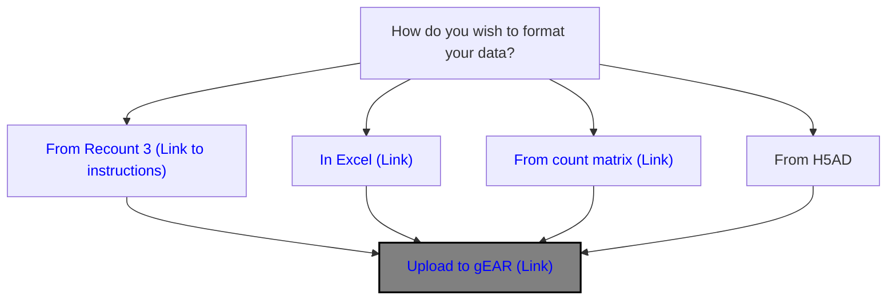
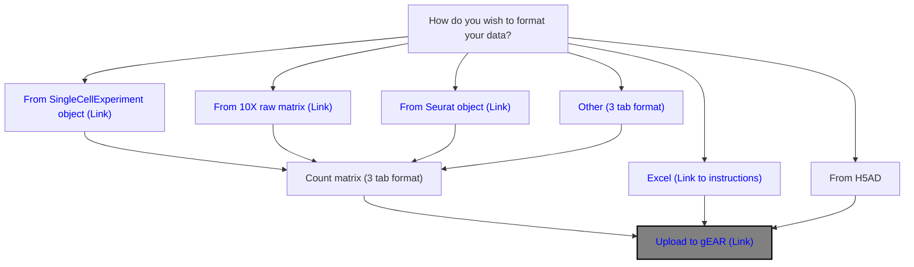

# Welcome to the gEAR upload documentation!

The gene Expression Analysis Resource platform currently supports the upload of:

- Bulk RNASeq data
- Single-Cell Sequencing data
- Microarray data
- Spatial transcriptomics data
- Epigenetic data

To assist users with uploading their data, we maintain documentation for
uploading data from several different starting formats including programmatically generated files or through Excel. To find the documentation
best suited for your upload needs, please see the links below. If you have any questions, or would like assistance with uploading please contact the curator team [(Contact us)](https://umgear.org/contact.html).

> [!IMPORTANT]
>
> ## Data Requirements
>
> All data uploaded to the gEAR platform must be de-identified and contain no personally identifiable information (PII), protected health information (PHI), or other data subject to regulatory obligations.
>
> By uploading data to gEAR, you represent that:
>
> - The data being uploaded was collected, processed, stored, and shared in accordance with all applicable laws and regulations
> - There is no PII or PHI present in the data upload
> - You have obtained all necessary consents, permissions, and authorizations needed for use of the data

## Using the Dataset Uploader

Open the [Dataset Uploader](https://umgear.org/upload_dataset.html) from "Dataset Uploader" in the navigation panel (you must be logged in). The uploader walks you through these steps:

1. **Enter metadata.** Fill in the form or upload the completed [metadata template](https://umgear.org/user_templates/metadata_template.xlsx) with "Or upload a metadata file". Choose the "Dataset type" (Single-cell RNA-seq, Bulk RNA-seq, Microarray, Spatial or Epigenome). If your data are in GEO, enter the GEO ID (like GSEnnnnn or GSMnnnnnnn) and click "Lookup" to fill in the contact, organism, platform, instrument, library and PubMed fields automatically; check the results before continuing. Confirm that the data contain no personally identifiable information and click "Submit metadata".
2. **Upload dataset.** Choose a format -- "MEX / 3-tab format", "MS Excel", "RDS / Seurat", "H5AD / Python", "Spatial (in tar format)" or "Epigenetic Data" -- then choose your file and click "Upload dataset". Each format has a "Learn more" link with examples. (Uploading from a URL instead of a file is planned but not yet available.)
   - **MEX / 3-tab:** upload a `.tar`, `.tar.gz` or `.zip` archive (the MEX example download is a `.tar` file). For 3-tab it must contain `expression.tab`, `genes.tab` and `observations.tab`. For MEX (10x Genomics Cell Ranger output) it must contain `matrix.mtx`, `barcodes.tsv` and `genes.tsv`, or the newer gzipped `matrix.mtx.gz`, `barcodes.tsv.gz` and `features.tsv.gz`; these may sit inside a folder in the archive (for example `filtered_feature_bc_matrix/`). The genes file must have Ensembl IDs in its first column. MEX files contain no cell metadata, so the only cell groupings come from clustering. gEAR clusters datasets of type "Single-cell RNA-seq" automatically after upload, and you can re-cluster in the Single Cell Workbench.
   - **MS Excel:** the file must be `.xlsx`. Older `.xls` files are not accepted; open them in Excel and save as `.xlsx` first.
3. **Dataset processing.** gEAR converts and checks your file on the server. The page shows the status; click "Continue" when it finishes.
4. **Dataset post-processing.** If some metadata columns could be read either as numbers or as categories, the "Resolve ambiguous column data types" step asks you to mark each one as "continuous" or "categorical". This step is optional but helps the curators offer the right plot types.
5. **Finalize submission.** Choose whether the dataset is "Public" or "Private (can be changed later)" and click "Finalize submission".
6. **Curate dataset.** Your dataset is now in the Dataset Explorer, but it has no displays yet. Click "Curate dataset" to open the Single-gene curator and create the first displays (see [Curate data/ build plots](gEARWiki.md#curate-data-build-plots)). Spatial datasets are displayed automatically, and epigenome datasets skip this step ("View dataset").

Epigenome uploads have an extra "Build track hub" step; see [Epigenetic data (Gosling)](#epigenetic-data-gosling).

### Resuming a submission

Uploads are saved as you go. When you return to the uploader, any unfinished uploads are listed under "Submissions in progress" with their share ID, status, dataset type and title. Click "View / resume" to continue where you left off, or "Delete" to discard the upload. To begin a different upload, click "Start" under "Or start a new submission".

### Direct H5AD Uploads

gEAR supports uploads of H5AD datasets (those created using the Anndata structure).  If you plan to upload one of these, it is strongly recommended that the `Anndata.var` has unique identifiers as the DataFrame index, and gene symbol names in a "gene_symbol" column.  If gene symbols are in the index, we can infer Ensembl IDs based on what annotations are stored in our database. However, there is a chance Ensembl IDs may not be found for some gene symbols and they will be flagged with a generic identifier.

### Direct RDS / Seurat Uploads

If you have been working with your data in R, you can upload a Seurat object directly with the "RDS / Seurat" format. Save the object with `saveRDS()` (the file must end in `.rds`). gEAR converts it to H5AD on the server: the normalized "data" layer is used for expression values, dimensionality reductions (such as UMAP, t-SNE and PCA) are copied into the cell metadata so they can be plotted, and gene symbols are mapped to Ensembl IDs using the organism (taxon ID) given in your metadata. Genes whose symbols cannot be matched are given a generic identifier.

## Bulk RNAseq data

Bulk RNAseq data can be uploaded to gEAR through three paths (from Recount3 data, through Excel or via tab-deliminated files). In addition to the data files, every submission requires a standard metatdata template to be filled out with basic information about your dataset. A blank template form can be found on the upload page or linked [here](https://umgear.org/user_templates/metadata_template.xlsx).

> [!NOTE]
> Count files must be normalized prior to upload, any common normalization method is accepted

> [!TIP]
> To open the links in the flowchart, right click and choose open in new window otherwise link will show as blocked

- [Preparing bulk RNAseq data using code (overview slides)](https://docs.google.com/presentation/d/1lYbgACVi-931EHTGNIw1bSZWIIUBcg3o/edit?usp=sharing&ouid=102015920709954238045&rtpof=true&sd=true)
  - [Preparing bulk RNAseq data (R code)](https://github.com/IGS/gEAR/wiki/Prepare-3-tab-format-for-RNAseq-dataset-uploading)
  - [Preparing RNAseq data from Recount 3 (R code)](https://github.com/songeric1107/Host_data_on_gEAR/blob/225e61631db4f0a60acb3abdb90ba55ace814e87/script/prepare_from_recount3.md)
- [Preparing bulk RNAseq data via Excel (slides)](https://docs.google.com/presentation/d/1lU7wqWmeW907GBGfK0oBi06hcrvra-PY/edit?usp=sharing&ouid=102015920709954238045&rtpof=true&sd=true)
- [Example upload files](https://drive.google.com/drive/folders/1OYZ7-FjgTBwNrZDqBI3dAA7bv8QmwFE-?usp=sharing)

## Single Cell RNAseq

Single cell sequencing data can be uploaded to gEAR through multiple paths. The most common path for data upload is creating three tab-deliminated text files which are compressed together for upload, but other upload methods are avialable.  In addition to the data files, every submission requires a standard metatdata template to be filled out with basic information about your dataset. A blank template form can be found on the upload page or linked [here](https://umgear.org/user_templates/metadata_template.xlsx).

> [!NOTE]
> Count files must be normalized prior to upload, any common normalization method is accepted

> [!TIP]
> To open the links in the flowchart, right click and choose open in new window otherwise link will show as blocked

- [Preparing single cell data via code (slides)](https://docs.google.com/presentation/d/1_YlLlQCXobkfjtIQddSZBuOo8iz3Tgnf/edit?usp=sharing&ouid=102015920709954238045&rtpof=true&sd=true)
  - [Preparing single cell data (R code)](https://github.com/IGS/gEAR/wiki/Uploading-Single-Cell-Sequencing-data)
- [Preparing single cell data via Excel (slides)](https://docs.google.com/presentation/d/1ptk78OJAQJnyRKe3Gkejqa43Vh-cP21h/edit?usp=sharing&ouid=102015920709954238045&rtpof=true&sd=true)
- Example files
  - [Processed scRNA files](https://drive.google.com/drive/folders/1LHhhCIV5LmYspjfHccYr-gD1kW-bswut?usp=sharing)
  - [Raw scRNA matrix](https://drive.google.com/drive/folders/1c6pjqj-oruNeSsYDoZtJbZv-nEmF0bcT?usp=sharing)

## Microarray data

- [Prepare GEO microarray data for upload](https://github.com/songeric1107/Host_data_on_gEAR/blob/225e61631db4f0a60acb3abdb90ba55ace814e87/script/GEO_microarray_data_to_gEAR.R)

## Spatial data

Spatial transcriptomic data from various platforms can be uploaded to gEAR. Set the "Dataset type" to "Spatial" in the metadata step. Then, in the upload step, choose "Spatial (in tar format)" and select your platform from the dropdown so gEAR knows what type of data to expect. Uploads are a tarball with a ".tar.gz" extension; after selecting a platform, click "Show requirements" to see the files the tarball must contain and how they must be named.

Currently supported platforms:

- CosMx SMI
- Curio Seeker
- GeoMx DSP
- 10x Genomics Visium
- 10x Genomics Visium HD
- 10x Genomics Xenium

If you are interested in uploading spatial transcriptomic data from a platform that is not in the above list, it is recommended to follow the instructions for the Single Cell RNAseq section. As long as your metadata includes the spatial row and column (X and Y) coordinates, then those can be selected in various dataset curation plots.

Once uploaded, spatial datasets are displayed automatically when you search a gene; no curation is needed (see [Spatial displays](gEARWiki.md#spatial-displays)).

## Epigenetic data (Gosling)

Epigenetic data are uploaded and displayed using integration with the Gosling epigenome viewer. We use the [UCSC Track Hub](https://genome.ucsc.edu/goldenpath/help/hubQuickStart.html) system to allow for easy mapping to the Gosling viewer spec as well as allow for exporting to the UCSC Genome Browser for more advanced viewings.

You can upload your trackhub data from the [gEAR uploader page](http://umgear.org/upload_dataset.html).

1. Upload or enter your metadata. Make sure "Epigenome" is selected for "Dataset type".
2. In the Upload Dataset step, choose the "Epigenetic Data" type.
    - Optionally, prepopulate the track hub builder by entering a remote hub.txt URL ("Provide UCSC track hub URL to preload tracks") or by uploading a local file with "Upload hub.txt" (use one or the other, not both). Select the assembly, then click "Configure Trackhub".
    - If an uploaded hub.txt refers to track files by relative or local paths, gEAR warns you ("Hub file contains relative file references"); you will need to upload or link those track files yourself in the next step.
3. Create your hub data and your tracks data. For each track choose the "Track Type" (BigBed, BigWig, Hi-C or VCF) and either link a remote URL or upload the file.
    - To overlay several BigWig tracks (for example replicates), create a track and check "Check to make this track a multiWig container", then assign the other BigWig tracks to it with "Multiwig Group". Tracks in the group share the container's visibility setting.
4. Click "Build track hub", which starts the staging process. Some file types will also be converted to a format that Gosling can accept.
    - You can leave the page and resume later from "Submissions in progress".
5. When complete, you have the option to make this a public or a private dataset. After everything is finalized, uploading is complete!

Track hub files will be copied over to the gEAR server. This is to ensure that files are always available to be streamed by Gosling.

### Currently supported UCSC Track Hub fields

Any settings beyond the following will be ignored.

- track
- bigDataUrl
- shortLabel
- longLabel
- color
- visibility
- type
- container (multiWig only)
- parent (for tracks inside a multiWig container)

For the hub.txt file, we also accept the newer "useOneFile=on" single-file format. If your hub does not use this setting, ensure that the trackDb.txt file for the assembly you wish to use is present and listed in genomes.txt, as gEAR will only read the tracks for the selected assembly. Tracks for other assemblies are ignored. Multi-file hubs (without "useOneFile=on") can only be prepopulated from a hub URL, not from an uploaded hub.txt file.

### Currently supported dataset formats (Track Hub "type")

- bigBed
- bigWig
- hic
- vcfTabix

BigWig tracks can also be grouped in multiWig containers (the "container multiWig" and "parent" settings), which are drawn overlaid.

### Currently supported reference genome codes

- danRer10
- galGal6 (COMING SOON)
- hg19
- hg38
- mm10
- mm39
- rn6

If you want to upload epigenome data from one of the human references, because of concerns with personally-identifiable information, Hi-C and VCF file types will not be processed.

