# Welcome to the gEAR documentation

In addition to the text-based documentation here, short video guides are available from the "Guides" section at the bottom of the My Workspace dashboard ([umgear.org](https://umgear.org/)):

- [We have a new look!](https://youtu.be/guI161nTv2U) -- a tour of the refreshed dashboard
- [Search Faster](https://youtu.be/bKTzGKAvn7w) -- searching with gene lists and dataset collections
- [Compare conditions](https://youtu.be/7vsldnrjETw) -- comparing two conditions within a dataset
- [Create & Curate](https://youtu.be/DItayfJsldI) -- building and organizing displays for your datasets
- [Transfer Learning](https://youtu.be/7_oiT4Q5yag) -- projecting gene signatures onto new datasets with the Projection Tool

## What is gEAR?

The gene Expression Analysis Resource (gEAR) is a website for visualization and analysis of multiomic data both in public and private domains. The gEAR enables upload, visualization and analysis of bulk RNA sequencing, scRNA-seq, spatial transcriptomics, and epigenetic data.

gEAR is under active development and we are continuously adding new features. If you need assistance with any issues or have suggestions, please contact our user helpdesk [https://umgear.org/contact.html](https://umgear.org/contact.html).

The gEAR is maintained by a team at the University of Maryland School of Medicine, and led by Dr. Ronna Hertzano and Joshua Orvis. The gEAR is supported by the NIDCD/NIH R01DC013817, R01DC019370, NIMH/NIH R24MH114815 and the Hearing Health Foundation (Hearing Restoration Project).

## gEAR 2.0 Changes

- New thematic redesign
- New navigation panel on the left hand sidebar (follows from page to page)
- Renaming of various items/pages
  - Single-gene and Multi-gene curators are now called Single-Gene and Multi-gene Displays
  - profiles are now called Dataset Collections
  - gene carts are now called Gene Lists
- Home page has been changed to "My Workspace" Dashboard
- Resume where you left off history when logged in from the My Workspace Dashboard
- More customizations on panel size for Dataset Collections
- Video guides on how to perform various actions are found on specific pages
  - An interactive step-by-step tour of the gene search is available from the "New to gEAR? Click here." button on the My Workspace dashboard
- Citation is now included in the sidebar to easily copy to manuscripts

## Basic Features

### Creating a gEAR account

To create an account, click the "Log in" button at the top right of any page and then click "Sign up", or go directly to [Create gEAR Account](https://umgear.org/create_account.html). Enter your name, institution, email address and a password. You can also choose to receive email updates and to turn on colorblind mode. After you click "Create Account", gEAR emails you a verification code; enter it in the "Verification code" box and click "Verify" to activate the account.

Once you are logged in you have access to all the tools on the gEAR. To view or change your account settings, open the user menu at the top right and choose "User profile" (see [User profile and accessibility](#user-profile-and-accessibility)).

### Home page

The gEAR homepage ([umgear.org](https://umgear.org/)) is the "My Workspace" dashboard. It contains the gene expression search, highlighted and recently added datasets, a "Resume your work" table of your recent activity (when logged in), and the video "Guides". At any time on the site, you can return to the homepage by clicking the gEAR icon in the top left corner or "My Workspace" in the navigation panel.

If you are new to gEAR, click the "New to gEAR? Click here." button near the top of the dashboard. This starts a short interactive tour that highlights each part of the gene search (entering genes, choosing a gene list, exact matching, single- vs multi-gene displays, choosing a dataset collection, and your history). Click outside the tour at any time to exit it.

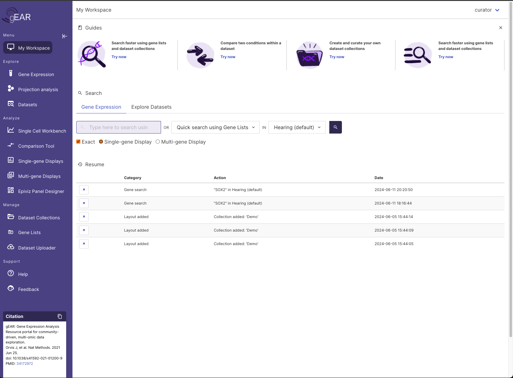

### Navigation Panel

There is now a navigation panel on the left hand side of the gEAR.  This navigation panel will follow between pages and allow the user to quickly access different modules within the gEAR.  As a user becomes more familiar with the symbols on the navigation panel, they can choose to minimize the panel to only display the symbols (without any text) by clicking on the arrow in the upper right hand corner of the navigation panel.

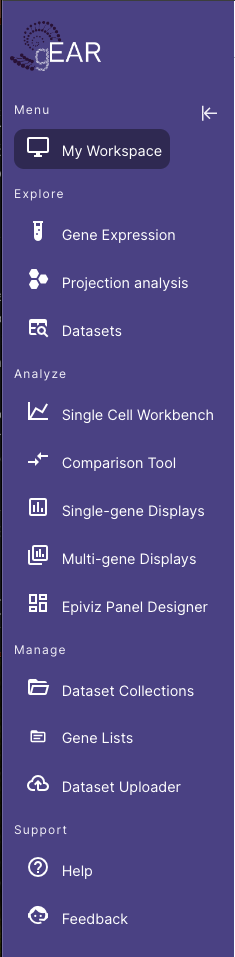

### Searching for genes of interest

Searching for genes of interest in public datasets is one of the most common uses of the gEAR platform. A good place to start is the gene expression search on the My Workspace dashboard:

1. **Enter gene symbols.** Type one or more gene symbols (separated by commas or spaces), or pick a saved gene list from the "Use Gene Lists" dropdown. Leave "Exact gene symbols only" checked to match symbols exactly; uncheck it to match any gene containing the text you typed.
2. **Choose a dataset collection** from the "Choose a Dataset Collection" dropdown.
3. **Choose display type:** "Single-gene Display" shows one plot per dataset for the selected gene, and "Multi-gene Display" shows plots that use all of your genes together (such as heatmaps).
4. Click **Search**.

The same search bar appears at the top of the Gene Expression page (labeled "Exact match" there), so you can change genes or collections without going back to the dashboard.

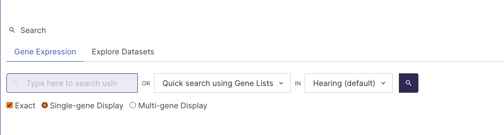

For more information about searching for genes of interest and other basic functions in gEAR see:

- [Walkthrough Video](https://www.youtube.com/watch?v=sr_kvm7W4OE)

### Finding datasets

If you wish to look at results for a particular dataset or explore what datasets are available, click the "Datasets" tab in the search area of the My Workspace dashboard, or click "Datasets" in the navigation panel to open the Dataset Explorer.

In the Dataset Explorer you can narrow the list with the "Filter controls" on the left: "Search by keyword", "Ownership", "Organism", "Dataset type" (Bulk RNASeq, Epigenetic, Microarray, Single-cell RNASeq, Spatial Transcriptomics) and "Date added". Use the "View:" buttons at the top of the page to switch between "Table view", "List view - Compact" and "List view - Expanded", and "Sort by" to change the order.

In table view, click the arrow at the start of a row ("Expand entry for more info and actions") to see the dataset details and action buttons. List views show the same buttons directly. The actions include:

- **View in expression viewer** -- opens the Gene Expression page with this dataset so you can search genes in it
- **View in projection tool** -- opens this dataset in the [Projection Tool](#projection-tool)
- **Add to Collection** / **View, add or remove displays from current collection** -- see [Creating a new collection](#creating-a-new-collection)
- **Download dataset as h5ad** (only for downloadable datasets)
- **Get shareable link** -- see [Sharing with others (permalinks)](#sharing-with-others-permalinks)
- **Analysis tools** -- a dropdown that opens the dataset in the Single-gene curator, Multi-gene curator, Comparison tool, or Single-cell analysis workbench
- For datasets you own: **Edit permalink**, **Edit metadata** and **Delete dataset**

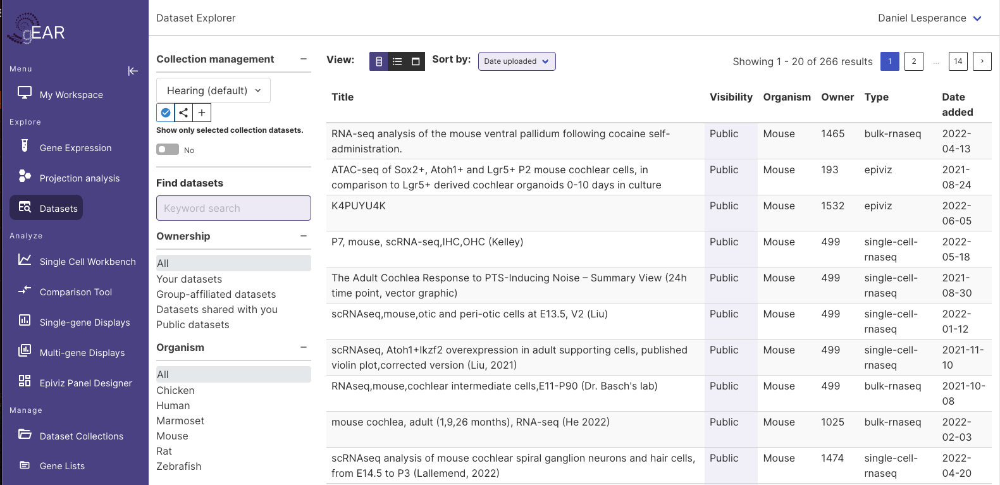

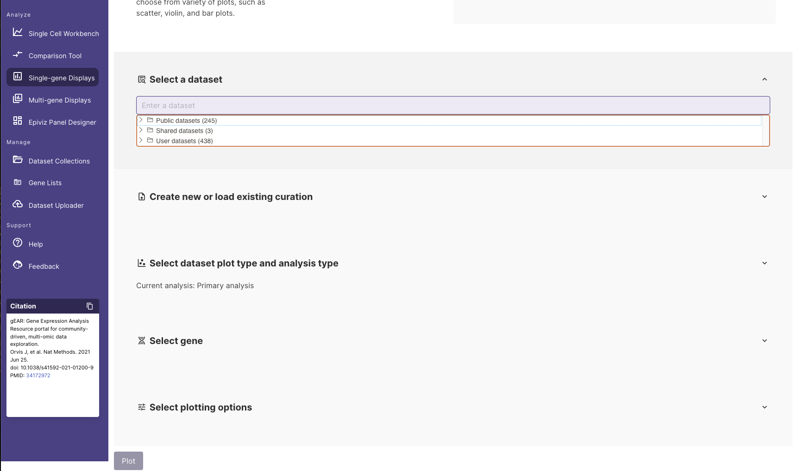

### Gene annotations

Gene annotations can be viewed on the gEAR platform in several ways. After searching for a gene, you will see several annotation results at the top of the screen.

- **Annotation by organism:**
  - There is an "Organism" dropdown to choose which organism's annotation to show. For example, when searching for Atoh1 the mouse annotation may be shown; choosing human shows the matching human gene (ATOH1) and updates the external links. Click "Set as your default organism" to use that organism's annotation automatically on future searches.
- **External resource links:**
  - These options open a new window with the pages for the searched gene on other web resources. Note: If your search includes more than one gene, the links will be displayed for the gene highlighted under search results in your search.

- **Deafness gene annotation:**
  - On gEAR there is additional annotation information related to deafness (for common deafness related genes). Clicking on the icon will provide a list of phenotypes and links out to deafness specific resources.

- **Functional annotation:**
  - Clicking on the functional annotation text will expand the window to show additional information for the gene of choice including: GO terms, full names, and any aliases.

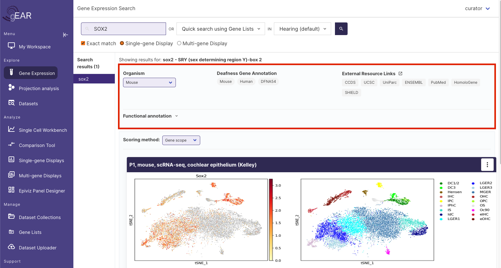

### Viewing dataset information

There are two ways of viewing the information associated with a dataset:

1. In the Dataset Explorer, expand the dataset's row in table view (or switch to "List view - Expanded"). This shows the long description, organism, owner, dataset type, annotation source, PubMed and GEO IDs, and which of your or highlighted collections the dataset appears in.

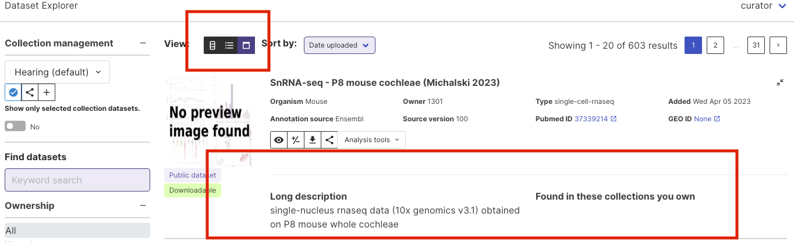

2. When viewing a dataset collection (for example after searching for a gene), open the dataset's menu (the three dots in the top right of its panel) and choose "Dataset Information" to open a popup with the dataset description.

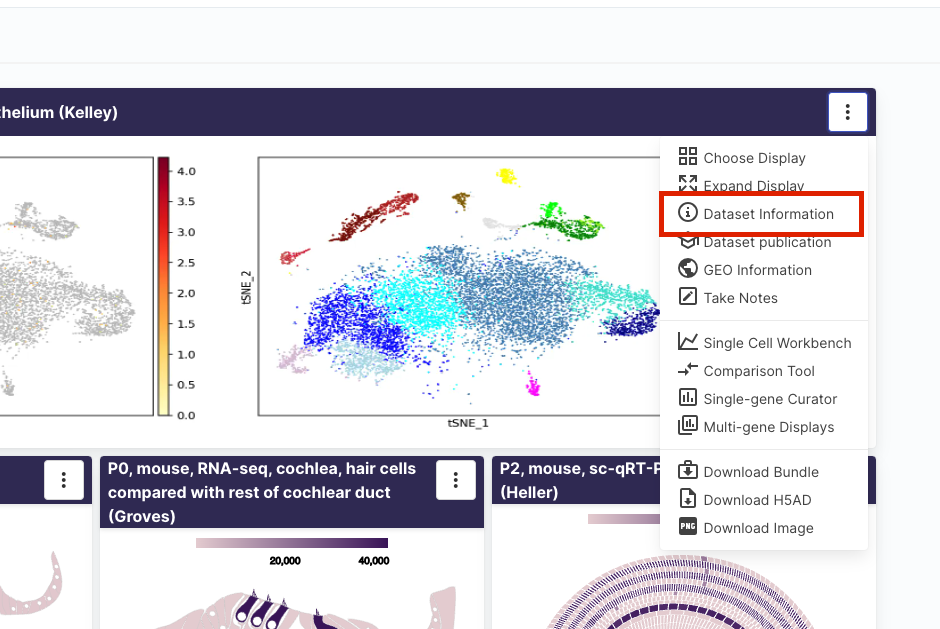

### Dataset panel menu

Each dataset panel on the Gene Expression and Projection pages has two buttons in its title bar: an expand button that opens the dataset in a larger, full-width view (click the shrink button to return), and a menu (three dots) with the following options. Options that do not apply to a dataset are hidden.

- **Choose Display** -- pick a different saved display for this dataset (yours or the dataset owner's) for the current view
- **Dataset Information** -- description of the dataset
- **Dataset publication** -- opens the PubMed entry (if a PubMed ID was provided)
- **Citation** -- shows a citation for the dataset with a "Copy to clipboard" button
- **GEO Information** -- opens the GEO entry (if a GEO ID was provided)
- **Take Notes** -- not yet available
- **Single Cell Workbench**, **Comparison Tool**, **Single-gene Curator**, **Multi-gene Displays** -- open the dataset in that tool
- Any extra links the dataset owner has added
- **Download Bundle** -- the original files as uploaded (downloadable datasets only)
- **Download H5AD** -- the processed H5AD file (downloadable datasets only)
- **Download Image** -- the current plot (PNG or SVG depending on the display; an HTML report for spatial displays)
- **Download Projection** -- the projection output, on the Projection page only
- **Download Metadata** -- the dataset's metadata file

Two extra controls may appear above the plots:

- **Choose ortholog** -- when your gene maps to more than one ortholog in a dataset from another organism, this dropdown lets you pick which one to plot.
- **SVG expression scoring method** -- controls how colors are scaled in SVG (anatomical image) displays: "Gene scope" scales to the range of the searched gene, "Tissue scope" scales each sample to its own range, "Sample scope" scales to the range of the whole dataset, and "Owner-defined scope" (the default) uses the setting chosen by the dataset owner.

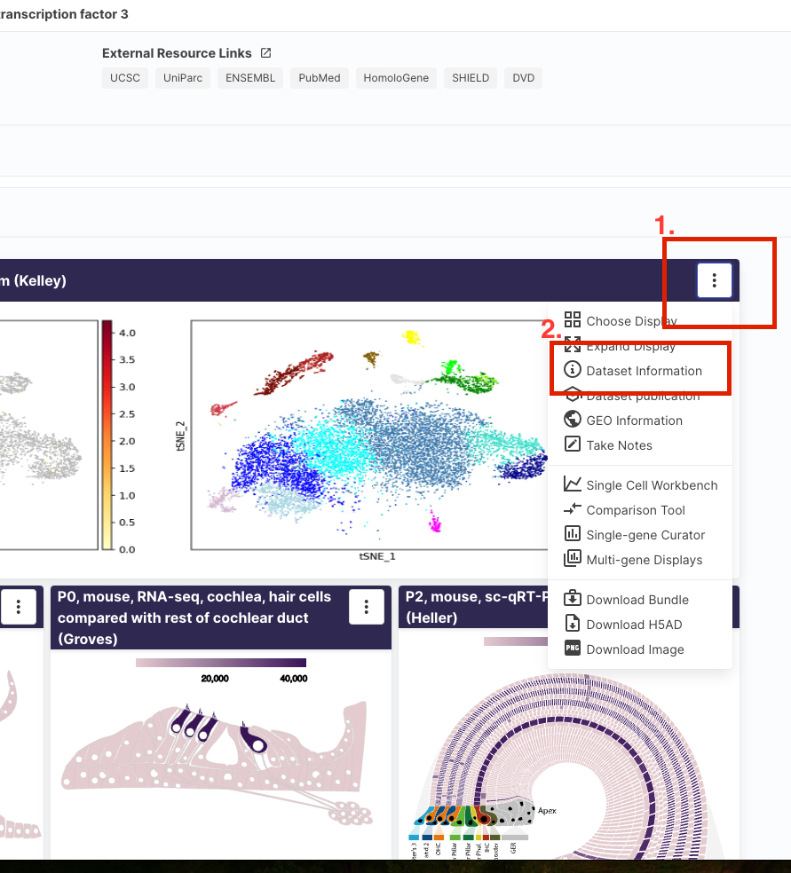

### Dataset Collections

Dataset collections are gEAR's way of collecting together datasets around a similar topic. The gEAR team maintains a number of curated dataset collections but any user can create their own dataset collection of datasets to explore.

#### Selecting a premade collection

To select a dataset collection you wish to search within, use the "Choose a Dataset Collection" dropdown in the gene expression search. You will see options for highlighted dataset collections, dataset collections you own, dataset collections you've recently visited, dataset collections from groups you are a part of, and dataset collections shared with you.

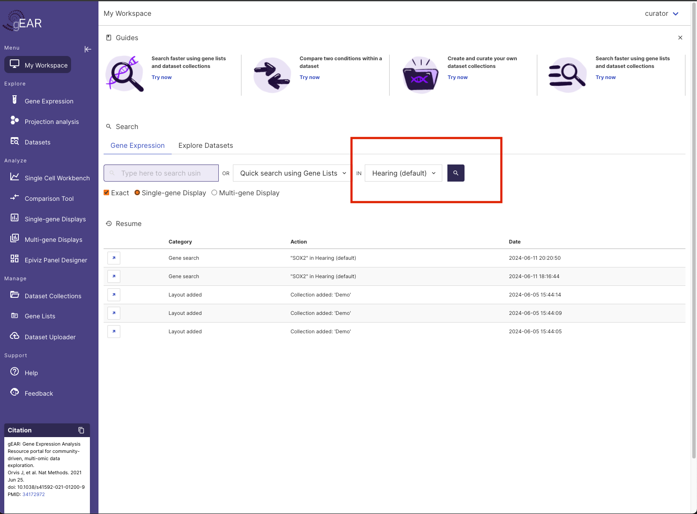

The default dataset collection (Hearing) contains datasets that offer a broad overview of gene expression, while other dataset collections may be devoted to specific organisms (e.g. zebrafish) or collections of displays used in individual publications. Dataset collections can be created and modified in the Dataset Explorer (Note: you can't directly modify dataset collections owned by others but feel free to make duplicates with any modifications you wish).

#### Creating a new collection

Open the Dataset Explorer ("Datasets" or "Dataset Collections" in the navigation panel). Under "Collection management" at the top of the left bar:

1. Click the plus button ("Create a new collection"), enter a name and save it. The new collection becomes the selected collection in the dropdown.
2. Find a dataset you want to add. In table view click "Add to Collection" in the "Displays" column; in list view click the "View, add or remove displays from current collection" button.
3. A window opens showing "Your Displays" and "Displays by Dataset Owner". Use the plus button on a display to add it to the collection and the minus button to remove it. You can add the same dataset more than once with different displays, which is useful for showing the same data in two different ways.

Other "Collection management" buttons let you "Make default collection everywhere" (use this collection by default for your gene searches), "Rename collection title", "Rename collection permalink", "Get shareable link" and "Delete this collection". Use "Toggle collection access" to make the collection public or private, and turn on "Show from this collection only" to list only the datasets already in the selected collection.

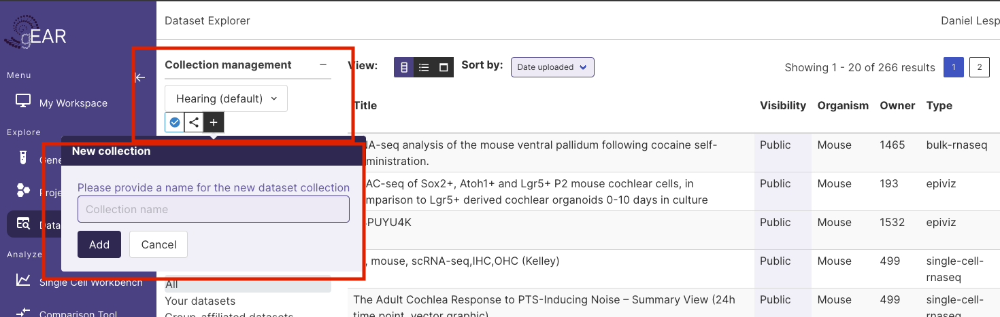

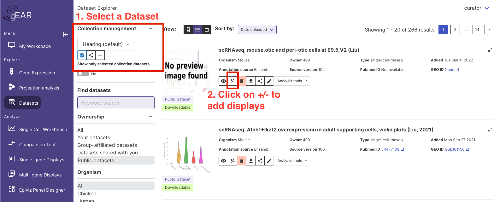

#### Arranging a collection

The layout of collections (e.g. how they are viewed when searching) can be altered in the Dataset Explorer.

First, select the collection you wish to alter in the "Collection management" dropdown (note: you can only alter collections you own, but feel free to make duplicates of other dataset collections and alter however you wish).

Next click the "Collection arrangement view" button (the last button under "View:"). If you do not own the selected collection, this button is not shown.

The arrangement view shows two grids, "Single-gene view" and "Multi-gene view", because single-gene and multi-gene searches can use different layouts. Drag a panel to move it anywhere on the grid, and drag any edge or corner to change its width or height. Panels that overlap are marked in red, and saving is disabled until the overlap is fixed. Click "Save" when finished; this saves both the single-gene and multi-gene arrangements.

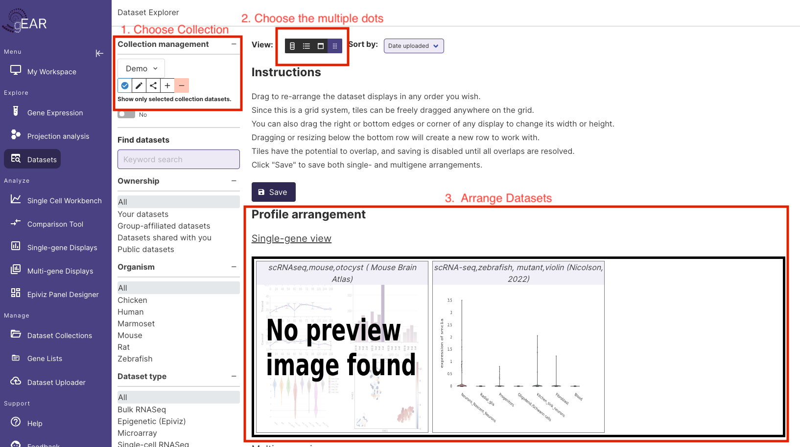

### Sharing with others (permalinks)

Datasets, dataset collections and gene lists can each be shared with a link that opens the item directly.

- **Dataset:** in the Dataset Explorer, click "Get shareable link" on the dataset entry. The link has the form `https://umgear.org/p?s=<dataset permalink>`.
- **Dataset collection:** select the collection under "Collection management" and click "Get shareable link" (`https://umgear.org/p?l=<collection permalink>`).
- **Gene list:** in the Gene List Manager, click "Get shareable link" on the list (`https://umgear.org/p?c=<gene list permalink>`). Links to weighted gene lists open in the Projection Tool.

The link is copied to your clipboard. Owners can replace the random part of the link with something readable using "Edit permalink" (datasets and gene lists) or "Rename collection permalink" (collections). To open a shared dataset or collection with a gene already searched, add `&g=<gene symbol>` to the link, for example `https://umgear.org/p?l=<collection permalink>&g=Sox2`.

You can also build links to the Gene Expression page yourself with these URL parameters:

- `share_id` -- a dataset's permalink, to show a single dataset
- `layout_id` -- a dataset collection's permalink
- `gene_lists` -- one or more gene list permalinks, separated by commas
- `gene_symbol` -- one or more gene symbols to search

For example: `https://umgear.org/expression.html?layout_id=<collection permalink>&gene_symbol=Sox2`

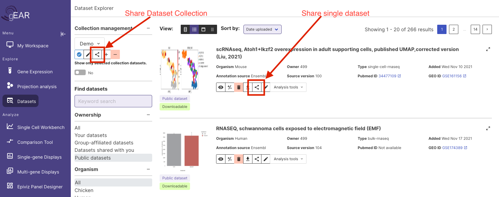

### Spatial displays

Spatial transcriptomics datasets are shown automatically; there is no curator step. When you search a gene, the panel for a spatial dataset shows the tissue image (if the platform provides one) next to two overlays: expression of the searched gene and the cell clusters. You can zoom and pan with the mouse, and click entries in the cluster legend to hide or show individual clusters.

Click the expand button in the panel title bar to open the larger spatial viewer. In addition to larger spatial plots, the expanded view shows UMAP plots colored by expression and by cluster, a violin plot of the gene's expression in each cluster, and an "Image Channel" selector when the image has more than one channel. If you are logged in, you can save the current view as a display: enter a "Display name", optionally check "Make this the default display", and click "Save settings".

"Download Image" in the panel menu saves the spatial display as an interactive HTML report that you can open in a web browser.

### Epigenome displays

Epigenome datasets (for example ATAC-seq, ChIP-seq, Hi-C or variant tracks) are shown as genome browser tracks using the [Gosling](https://gosling-lang.org/) viewer. They are uploaded as UCSC track hubs (see the [upload documentation](https://github.com/IGS/gEAR/blob/main/docs/wiki/UploadingOverview.md#epigenetic-data-gosling)).

When you search a gene, an epigenome panel shows where you are in the genome and a "Regional view around" your gene: a gene and exon annotation track followed by the dataset's tracks (signal tracks such as BigWig, interval tracks such as BigBed, Hi-C contact maps, and VCF variants). Tracks grouped in a multiWig container are drawn overlaid, which is useful for comparing replicates.

Click the expand button in the panel title bar for more options:

- **Side-by-side view:** the expanded view shows two regions, Panel A and Panel B. Type a second gene in "Search for a gene in Panel B:" to compare, for example, two genes or a gene and its regulatory region.
- **View in UCSC Genome Browser:** opens the same track hub in the UCSC Genome Browser, with the displayed regions highlighted, for more advanced browsing.

"Download Image" in the panel menu saves the current view as a PNG.

## Analysis tools

gEAR incorporates several tools for analyzing data with the goal of improving the reusability of genomic data. Graphical interfaces are built around common analysis tools (e.g. a Seurat pipeline for single-cell data) to make the tools more accessible for those without coding experience or the need to download data. The tools can be accessed from the navigation panel, from the "Analysis tools" dropdown for each dataset in the Dataset Explorer, or from the menu on each dataset panel.

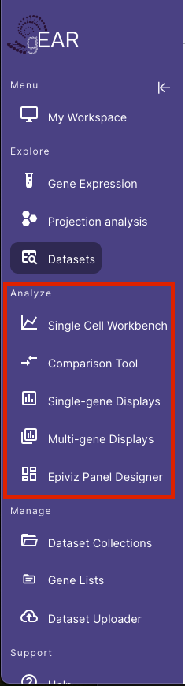
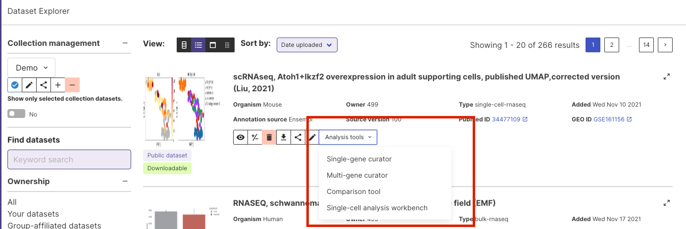

### Comparison tool

The comparison tool ([Link](https://umgear.org/compare_datasets.html)) compares gene expression between two conditions within a dataset (e.g. bulk RNA-seq treatment vs control) and can test for statistically significant differences. A video guide, [Compare conditions](https://youtu.be/7vsldnrjETw), is also available.

1. **Select a dataset.**
2. **Select conditions you want to compare.** Choose the "Series to compare" (a metadata column), then the "X-axis (query) condition" and "Y-axis (reference) condition". You can also add "Extra filters to apply to both conditions" to compare only a subset of the data.
3. **Select comparison parameters [Optional]:**
   - "Select test": None, T-test, T-test (overestimated variance) or Wilcoxon rank-sum. P-values are adjusted with the Benjamini-Hochberg method.
   - "P-value cutoff" and "Cutoff filter": either "Colorize" genes that pass the cutoff or "Filter out" genes that do not.
   - "Report output as": None - Raw values, Log2 (default) or Log10.
   - "Fold Change Cutoff (>=N)": genes below this fold change (default 2) are left off the plot to keep plotting fast.
   - "Standard Deviation": show only genes whose fold change is more than 1 or 2 standard deviations from the mean, or "No filter".
4. Click **Plot**. To change settings afterwards, click "Edit Parameters".

Statistical tests need more than one observation (replicate samples or cells) in each condition. Without replicates the plot is still drawn, but no p-values are calculated.

**Working with genes on the plot:** click and drag on the plot to select genes. The selected genes are listed in a table (gene, Ensembl ID, p-value, fold change). To save them, enter a name under "Enter name of collection", choose a "Collection type" ("Unweighted (saves only selected genes)" or "Weighted (saves all genes from dataset)") and click "Save"; this creates a new gene list. "Download selected" saves the table as a file. Use "Highlight specific genes" to type gene symbols or pick a gene list and mark those genes on the plot (only genes found in the dataset are highlighted); "Clear selection" removes the highlighting.

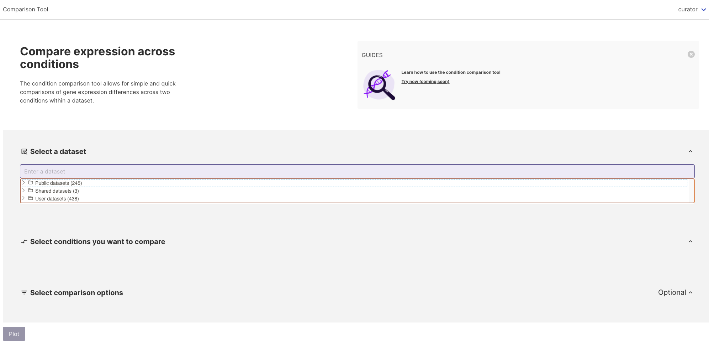

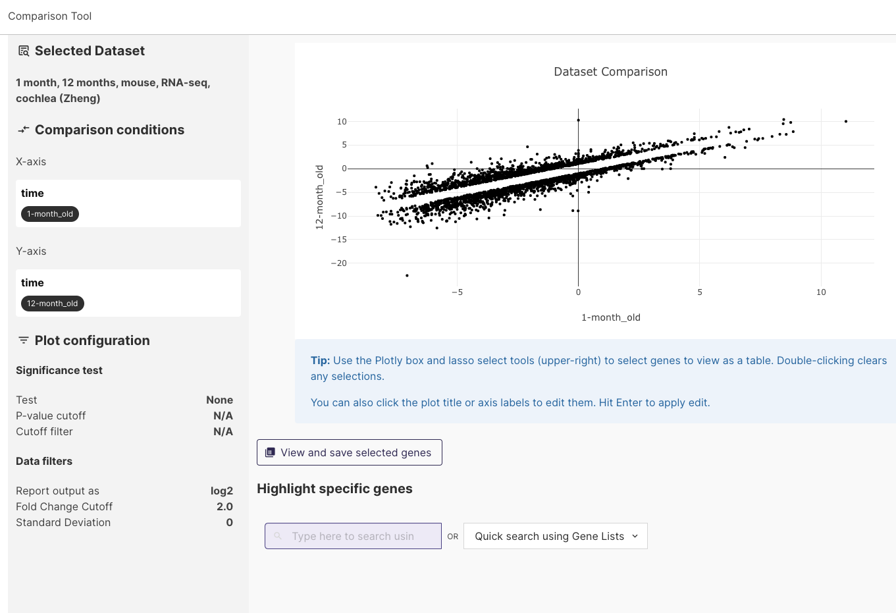

### Single Cell Workbench

The workbench for single cell RNAseq (scRNAseq) is designed to allow biologists meaningful access to single cell data, even with limited informatics training. It follows the workflow of a standard Seurat/Scanpy pipeline ([Link](https://umgear.org/sc_workbench.html)).

After choosing a dataset under "Select a dataset", use "Select new or saved analysis" to either start a "New" analysis or open a stored analysis. Stored analyses start with precomputed results, either uploaded by the dataset owner or saved earlier on gEAR. If you open the primary (uploaded) analysis, you can use "Create a labeled t-SNE": enter a gene symbol to see a t-SNE colored by both expression and cluster/cell type.

A new analysis moves through these steps. In each step there are recommended settings, but you can change them to better fit your dataset or question.

1. **Preliminary dataset information** -- initial composition plots.
2. **Primary dataset filtering** -- minimum/maximum genes per cell and cells per gene; click "Apply filters".
3. **QC - filter out mitochondrial content** -- set the "Mitochondrial gene prefix", filter by percent or read counts, and click "Compute and plot".
4. **Identify highly-variable genes** -- choose the Seurat or Cell Ranger method and cutoffs (limited to 2,000 genes).
5. **Perform Principal Component Analysis (PCA)** -- optionally color by genes and view top genes per component. "Save PCs as a pattern signature" saves the gene loadings as a weighted gene list for use in the [Projection Tool](#projection-tool).
6. **Perform t-SNE or UMAP analysis** -- choose the number of neighbors, number of dimensions and method.
7. **Perform clustering** -- Leiden clustering; adjust "Resolution" for more or fewer clusters.
8. **Find marker genes** -- compute the top N markers per cluster, "Download table", "Visualize" selected genes, and "Save selected" markers as an unweighted gene list.
9. **Rename, merge, or delete clusters** -- type new labels, uncheck "Keep" to delete a cluster, and give clusters the same label (with "Check to merge clusters with duplicate labels") to merge them. Click "Rerun with labels" to apply. Merging and deleting are irreversible.
10. **Compare genes and clusters** -- choose a "Query cluster" and a "Reference (comparison) cluster" (or All), a "Method" (T-test (overestimated variance), T-test, Logistic regression or Wilcoxon rank-sum) and a "P-value correction method" (Benjamini-Hochberg or Bonferroni), then click "Run". Results are shown for query vs reference and reference vs query, with "Show table" and "Download table" buttons.

The progress bar at the top shows which steps are complete; click "Toggle icon guide" for a key. Clicking a completed step takes you back to it, except for filtering steps, which change the dataset and cannot be revisited.

**Analysis options** (shown at the top once an analysis is open):

- New, unsaved analysis: "Download analysis H5AD", "Rename", "Save" and "Delete".
- Saved analysis: "Download analysis H5AD", "Rename", "Make a public copy" (lets others use your analysis) and "Delete".

Saved analyses can be chosen as the analysis in the single-gene and multi-gene curators.

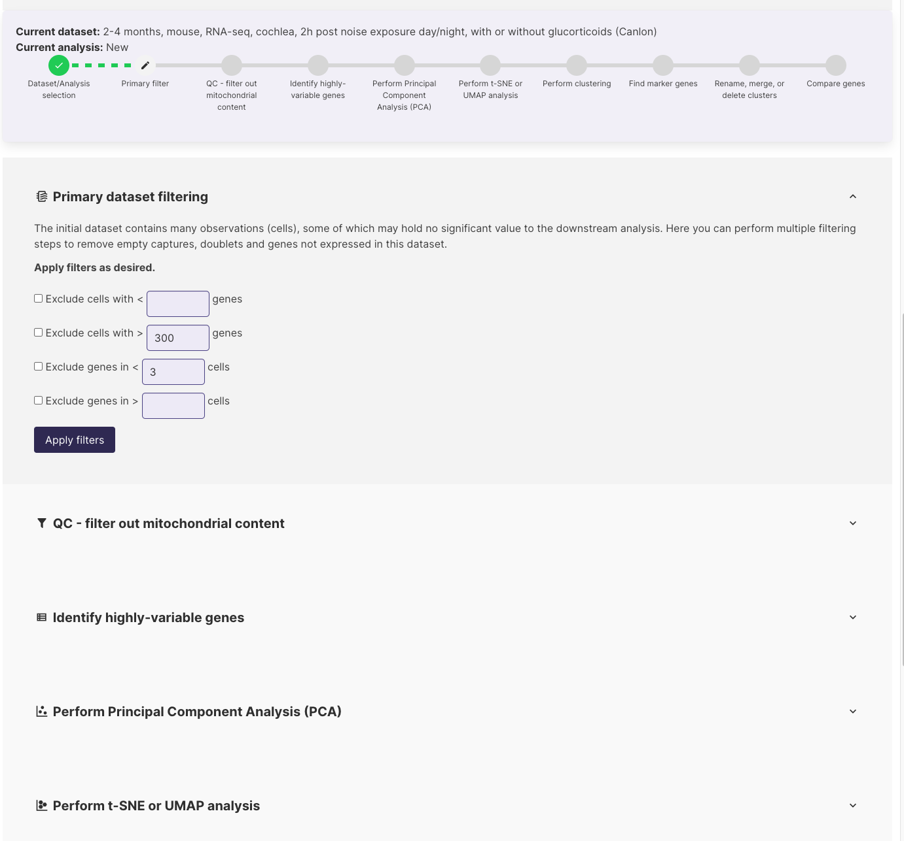

### Multigene curator

The multigene curator ("Multi-gene Displays" in the navigation panel, [Link](https://umgear.org/multigene_curator.html)) allows for the creation of displays and plots involving more than one gene (e.g. heatmaps, volcano plots, quadrant plots, etc).

#### Steps to create a multigene display

1. Select a dataset to plot
2. Choose whether to create a new plot ("Curate new display") or clone a previously curated plot
3. Choose a plot type and which analysis to use (see [Display types](#display-types))
4. Add gene names of interest.
Genes can either be typed in or chosen from a gene list with the "Use Gene Lists" dropdown. Only genes found in the dataset are added; at least 2 found genes are required.
5. Select what groups and plot attributes to include.
Many of these options can be changed on the next page as well.
6. Create plot.
After creating the plot, the display can be saved for the dataset ("Save as new display"), or downloaded as an image. Note: if you make a multigene display the default view for a dataset, it will only be used as the default view when "Multi-gene Display" is selected during a search. For volcano and quadrant plots you can also select genes on the plot and save them as a new gene list.

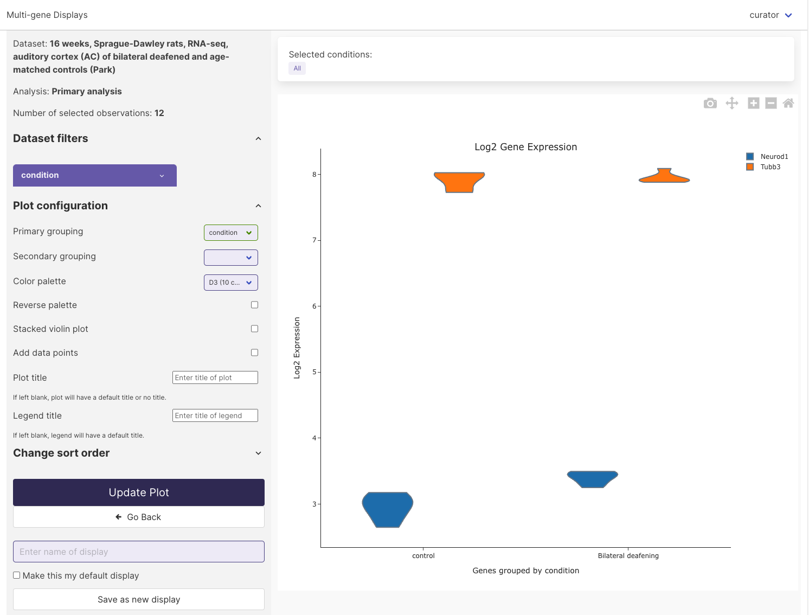

### Projection Tool

The Projection Tool ("Projection Tool" in the navigation panel, [Link](https://umgear.org/projection.html)) measures how strongly a known gene pattern (a "signature", such as a principal component or NMF pattern from one dataset) is present in every sample or cell of other datasets. This is sometimes called transfer learning. See the video guide [Transfer Learning](https://youtu.be/7_oiT4Q5yag).

**Patterns** are gene lists. Weighted gene lists give one or more numeric weights per gene (for example PCA loadings); unweighted gene lists treat every gene equally. You can create them by uploading a file in the [Gene List Manager](#gene-lists), with "Save PCs as a pattern signature" in the [Single Cell Workbench](#single-cell-workbench), or by saving a weighted list from the [Comparison tool](#comparison-tool).

To run a projection:

1. Choose a pattern with "Search for a pattern". For weighted lists, select which weights (patterns) to use; the "Top 5", "Top 10", "Top 20" and "All weights" shortcuts help with long lists. Click "Proceed".
2. Choose a dataset collection.
3. Choose "Single-pattern Display" (one plot per pattern, like a single-gene display) or "Multi-pattern Display" (all selected patterns plotted together, like a multi-gene display such as a heatmap).
4. Under "Select algorithm" choose one of the following (click "Which to select?" for a detailed explanation):
   - **Principal Component Analysis (PCA)** -- for patterns from a PCA; each sample's score is the sum of gene loadings multiplied by expression.
   - **Least-squares optimization for NMF** -- for NMF patterns; estimates sample scores by linear least squares (projectR).
   - **Fixed gene weights in NMF re-run** -- for NMF patterns; re-runs NMF with the original gene weights held fixed (SJD).
   - **Binary Gene Count** -- counts how many genes in the pattern are expressed in each sample. Only available for unweighted gene lists, and intended for single-cell data.
5. Optionally check "Z-score normalize gene expression" (can add noise if many low-expression genes are present) and "Set negative coefficient weight outputs to zero" (applied when plotting only; the saved output is unchanged).
6. Click the search button to run the projection.

Each dataset panel then shows the pattern score in place of gene expression, using the dataset's normal displays. Use "Select pattern" to switch between patterns; the strongest positive and negative contributing genes are listed, and "View all genes with weights" (or "View list of genes" for unweighted lists) shows the full list. "Download Projection" in the panel menu saves the projection output for downloadable datasets. Projections are saved, so running the same pattern on the same dataset again is fast. Epigenome datasets cannot be used for projection.

You can also start from a single dataset or gene list with the "View in projection tool" button in the Dataset Explorer or Gene List Manager.

### Gene lists

Similar to how dataset collections are used on gEAR to collect datasets, gene lists are used to make comparisons of multiple genes easier across multiple analyses. Gene lists have various functions throughout the site but their most common use is to create user defined lists of genes that can be added into multigene plots or other plotting functions. For example, if you find a set of genes in one analysis (or from a manuscript) and want to view how they differ between treatment groups in another dataset, you could either manually add the gene names each time you wish to use them or store them together in a gene list and be able to quickly access and share your gene lists with others.

Gene lists can be created manually, via upload, or directly from analysis outputs:

- **Manually/ via upload:**

Open the Gene List Manager by clicking "Gene Lists" in the navigation panel. It follows a similar layout to the Dataset Explorer, where you can search for public or private gene lists. To create a new list, click "Create new gene list" and choose a list type:

- **Unweighted gene list** -- gene symbols only. Click "Paste list of genes" to type or paste symbols (separated by commas, spaces or new lines), or "Upload file" to upload a text file with the same format (no quotation marks). gEAR looks up the Ensembl ID for each gene based on the organism you select.
- **Weighted gene list** -- genes with one or more numeric weights, for example loadings from a principal component analysis. Click "Upload file". The file must be CSV, tab-delimited or Excel and have a header row. The first column must be unique gene identifiers (such as Ensembl IDs), the second column gene symbols, and every column after that a numeric weight; the column headers become the weight (pattern) names. The file is validated before it is uploaded.
- **Labeled gene list** -- COMING SOON (for example marker genes for cell types).

Then enter a "Name of list", choose the "Organism", set "Visibility" (lists are private by default), add a "Longer description" and click "Save". Click "Click for requirements" on the upload form for examples of each file format.

For each list you can "View in expression viewer", "View in projection tool", "Download list as tsv", "Get shareable link", and, for lists you own, "Edit permalink", "Edit list metadata" and "Delete list". Weighted gene lists can only be viewed in the Projection Tool.

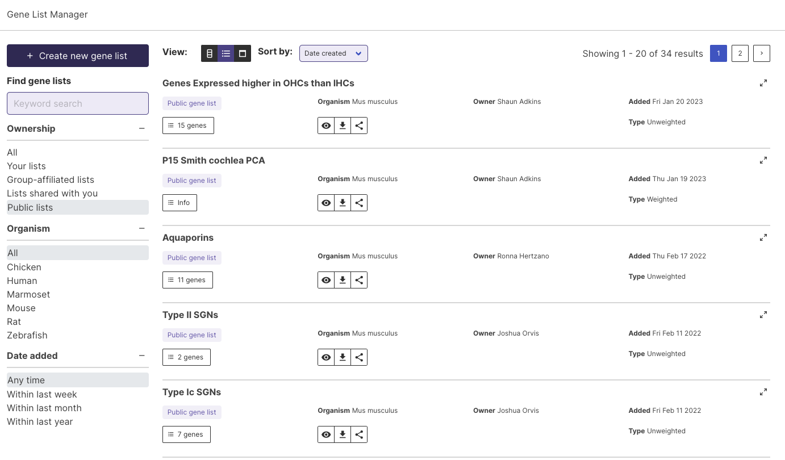

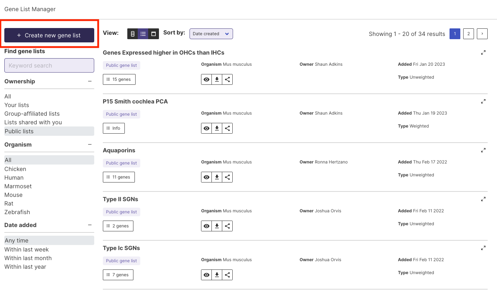

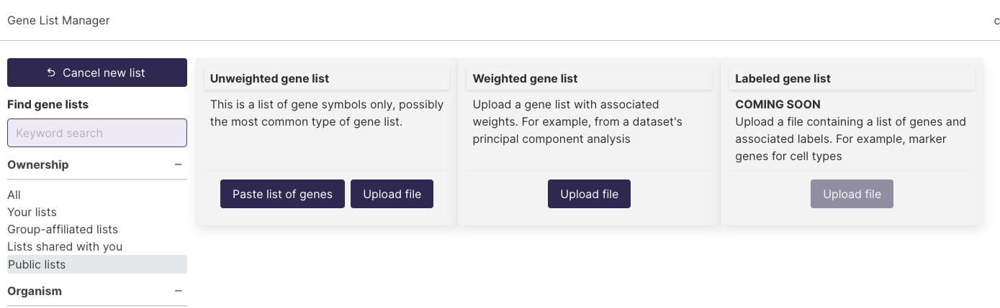

- **From the RNAseq comparison tool:**

In the comparison tool, you can create a new gene list directly from the plotting or statistical results. After making a plot, click and drag to select genes of interest; they appear in the "Selected genes" table. Enter a name, choose "Unweighted (saves only selected genes)" or "Weighted (saves all genes from dataset)" and click "Save" to create the gene list, or click "Download selected" to download the genes as a file.

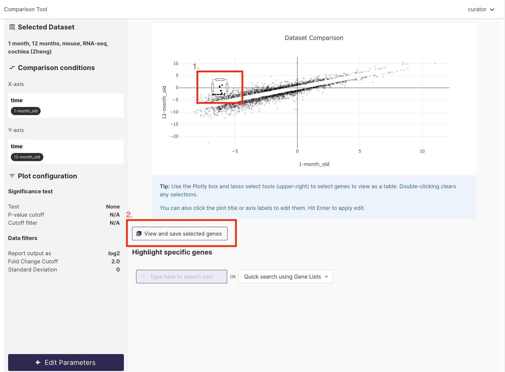

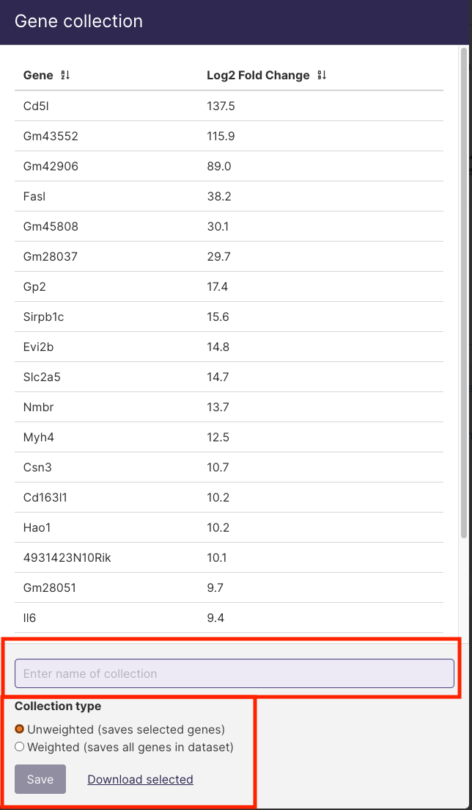

- **From the Single Cell Workbench:**

Marker genes can be saved as an unweighted gene list ("Save selected") and principal components as a weighted gene list ("Save PCs as a pattern signature").

- **Using created or public gene lists**

Gene lists can be used in the multigene curator and the gene expression search. To use one in the multigene curator (and create your own visualizations), choose the dataset you wish to view and then, in the "Select genes" step, use the "Use Gene Lists" dropdown to select a gene list or individual genes from the lists.

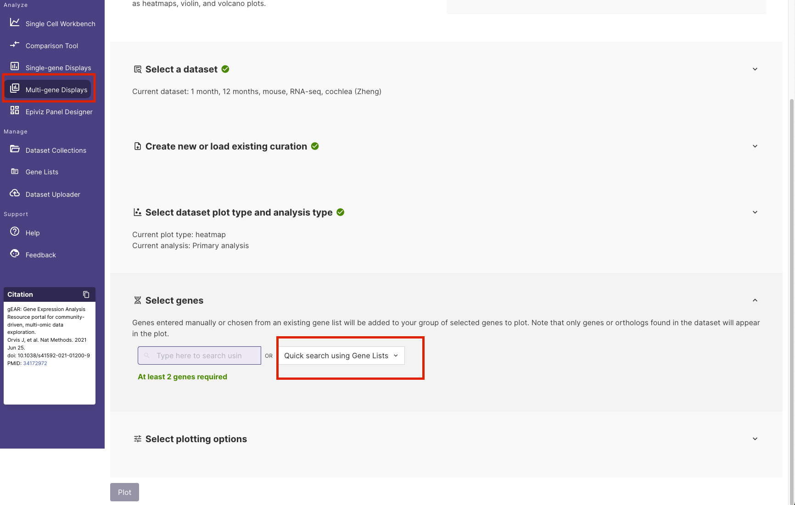

Gene lists can be used on already created visualizations using the gene expression search on the My Workspace Dashboard. First, select the "Multi-gene Display" option to change the search type from single to multigene. Then use the "Use Gene Lists" dropdown to select the gene list you would like to add. Press search to see multigene visualizations of your genes of interest (Note: not all dataset collections have multigene visualizations; the Multi-gene Displays tool can be used to create new visualizations).

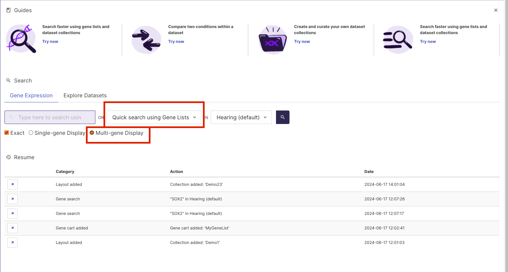

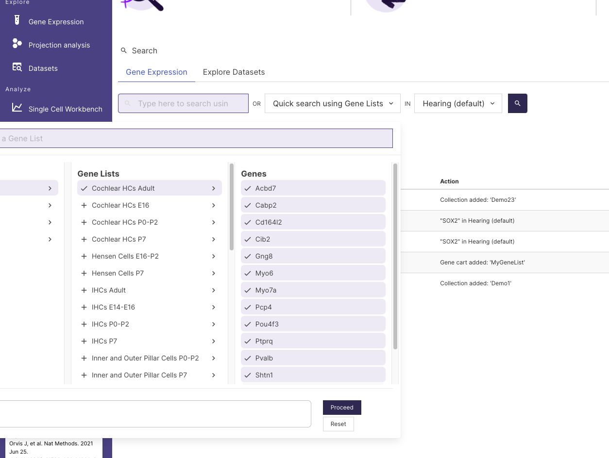

Multigene displays can also be toggled on the results page:

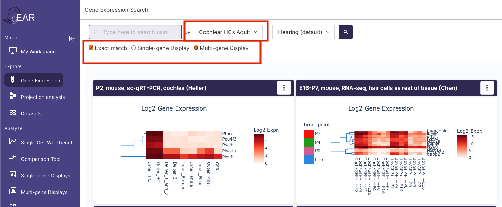

## Upload data

For more information on how to upload different types of data into gEAR, see our [upload documentation](https://github.com/IGS/gEAR/blob/main/docs/wiki/UploadingOverview.md).
Currently gEAR supports the upload of:

- Bulk RNAseq data
- Single Cell sequencing data
- Microarray data
- Spatial transcriptomics data
- Epigenome data (Through integration with Gosling)

## Curate data/ build plots

The ability to create a variety of visualizations for the same dataset is one of the major strengths of the gEAR platform. In addition to the displays created by the initial uploader, if there are visualizations that are better suited to your question about a dataset you can quickly create new custom displays based on either your own analysis or primary analysis done by the uploader.

Besides visualizations created in the Multi-gene Displays curator or analysis tools (see above), custom displays can be added to dataset collections. To open a dataset in the curation tool (the same tool you see following initial dataset upload), click "Single-gene Displays" or "Multi-gene Displays" in the navigation panel, choose the dataset you wish to make a new display for, and select "Curate new display" in the second step. Continue on each step selecting options necessary for your visualization.

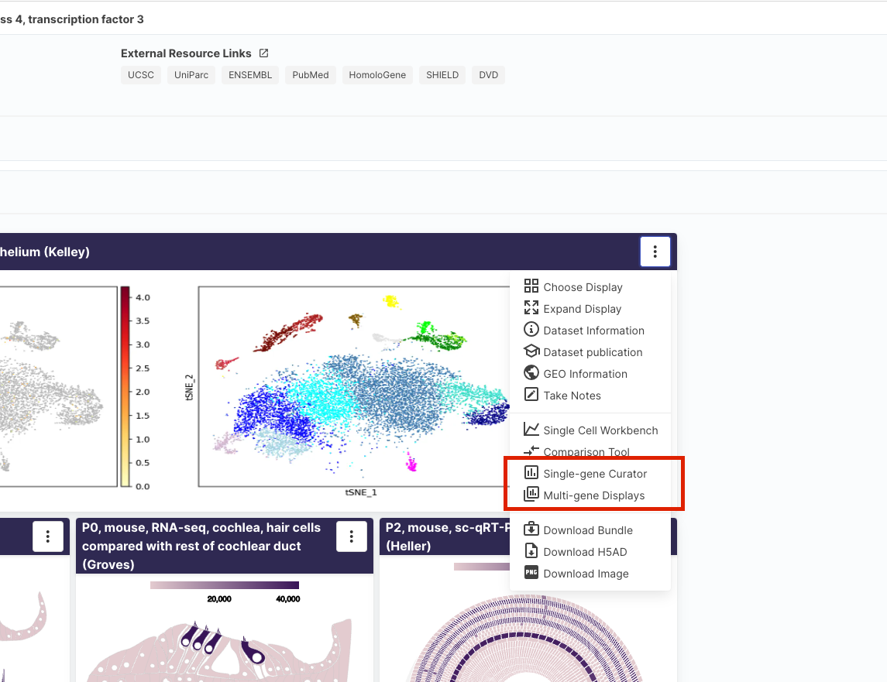

You can see displays shared and owned by you for a dataset when in a dataset collection. First select the three dots at the upper right of the dataset panel, and click "Choose Display". The window shows all the displays that are public or owned by/shared with you; click one to show it. To curate a new display, choose "Single-gene Curator" or "Multi-gene Displays" from the same menu.

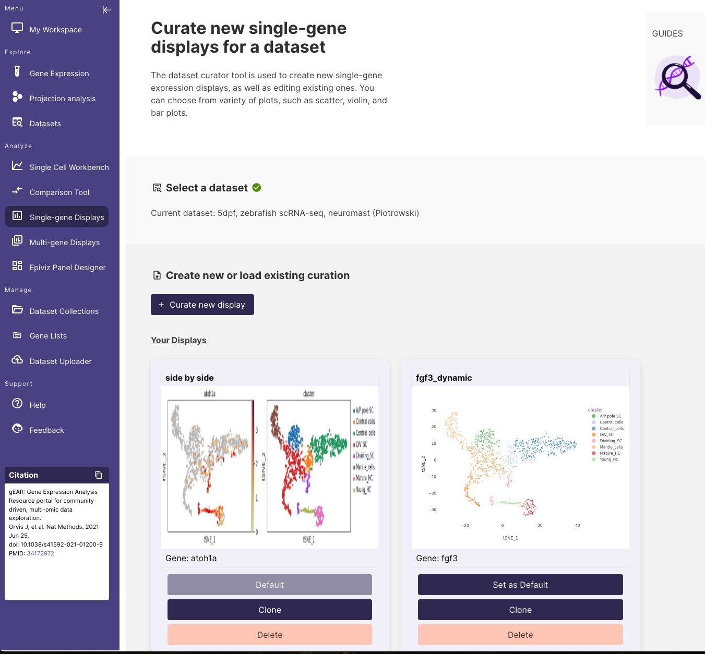

In the curator, you will first choose whether to curate a new display or start from a previously curated display. Each saved display card has "Set as Default" and "Clone" buttons, and your own displays also have "Delete".

You will then choose the analysis to plot. "Primary analysis (default)" plots data directly from the information uploaded (i.e. UMAP/tSNE coordinates or counts provided by the uploading individual). A stored analysis plots data that has been processed from the raw data in some way. Depending on the dataset, this could be an analysis uploaded by the dataset authors or a saved analysis you have conducted in one of the analysis tools (e.g. single cell workbench). Note: not all datasets will have a stored analysis (but you can create one).

After choosing the analysis and plot type, you'll have other options based on your plot type. Fill these out as necessary and click "Plot", where you can refine any options and see your visualization.

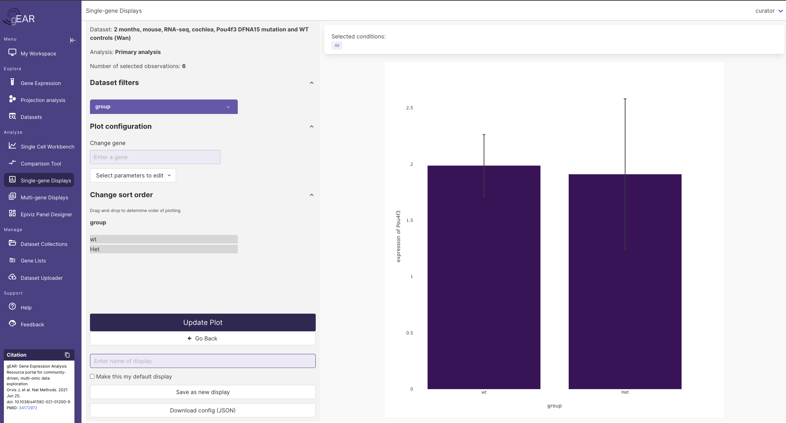

### Display types

The curators only offer plot types that the selected dataset and analysis can support.

**Single-gene Displays:**

| Plot type | Offered when |
| --- | --- |
| Scatter | Always |
| Bar, Violin | The dataset has at least one metadata column |
| Line | The dataset has a numeric metadata column or a "time_point" column |
| tSNE/UMAP dynamic | The dataset has stored tSNE, UMAP or PCA coordinates, or at least two numeric metadata columns |
| PCA static, tSNE static, UMAP static | The matching coordinates are stored in the dataset, or it has at least two numeric metadata columns |
| SVG image | The dataset owner uploaded an SVG image (see [Additional resources](#additional-resources)) |

**Multi-gene Displays** (the dataset must have at least one categorical metadata column):

| Plot type | Offered when |
| --- | --- |
| Dotplot, Heatmap, Violin | Always |
| Volcano | At least 2 categorical metadata columns |
| Quadrant | At least 3 categorical metadata columns |
| PCA, tSNE, UMAP | The matching coordinates are stored in the dataset, or it has at least two numeric metadata columns |

Spatial and epigenome datasets do not use the curators; see [Spatial displays](#spatial-displays) and [Epigenome displays](#epigenome-displays).

### Refining and saving a display

After plotting, you can filter which groups are shown ("Dataset filters"), change plot options ("Plot configuration"), switch genes ("Change gene"), drag and drop groups to "Change sort order", "Change colors" for each group, and set plot and legend titles (multi-gene plots). Click "Update Plot" to apply changes, or "Go Back" to return to the earlier steps.

To save, enter a name in "Enter name of display" and click "Save as new display". Check "Make this my default display" to show this display for the dataset whenever you search. If you cloned one of your own displays, you can check "Overwrite existing display instead" to update it rather than create a new one. "Download config (JSON)" saves the plot settings to a file.

### Editing dataset information after upload

The dataset information shown in the Dataset Explorer can be edited by the dataset's owner following upload. Expand the dataset's entry (or use a list view) and click "Edit metadata". You can then edit the title, long description, PubMed ID and GEO ID, and change "Access" (public or private) and "Is downloadable" (whether others can download the files). Click "Save edits" to keep your changes or "Cancel edits" to discard them.

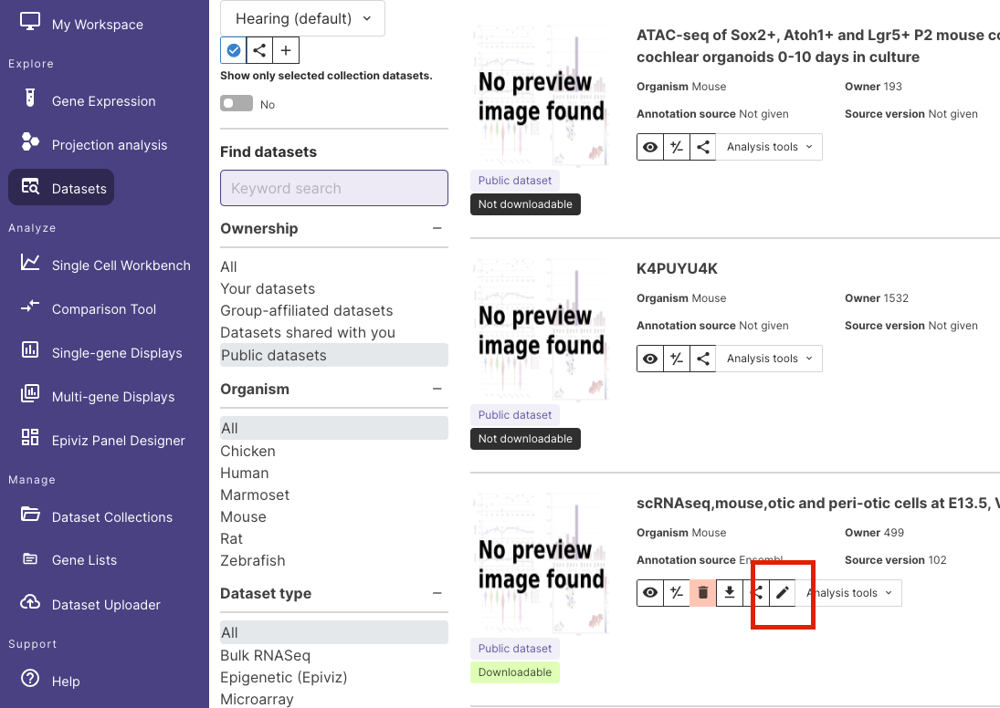

## Downloading data

Data in the gEAR platform can be downloaded, if the owner has marked the dataset as downloadable, in two ways:

- As a bundled file ("Download Bundle"), containing the data files exactly as they were uploaded by the dataset owner. For more information on data formats used during upload, see our upload documentation ([Link](https://github.com/IGS/gEAR/blob/main/docs/wiki/UploadingOverview.md))
- As a formatted H5AD file ("Download H5AD"), where each dataset upload is converted into an identical format. For more information on the H5AD file format see ([Link](https://anndata-tutorials.readthedocs.io/en/latest/getting-started.html))

To download a dataset, search a gene in a dataset collection that contains it, then use the dataset panel menu to select which download option you prefer. The menu also has "Download Metadata", "Download Image" and, on the Projection page, "Download Projection". H5AD files can also be downloaded from the Dataset Explorer with "Download dataset as h5ad", and analyses from the Single Cell Workbench with "Download analysis H5AD".

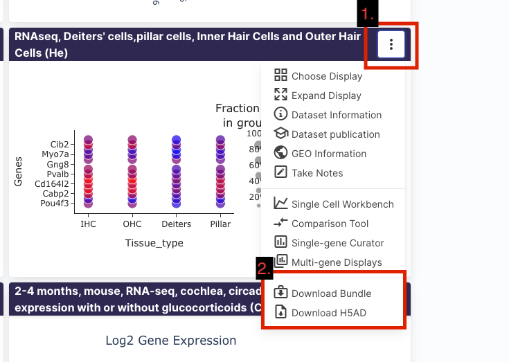

## User profile and accessibility

To change your account settings, open the user menu at the top right of any page and choose "User profile". On this page you can:

- Change your "Email" and "Institution"
- Click "Click if you want to update your password" to set a new password (enter it twice)
- Turn on "Colorblind mode" to view plots with a color scheme designed for color-vision deficiencies
- Choose to receive "gEAR updates" (periodic news by email)
- "Select gEAR site theme": White, Neutral (default) or Black

Click "Update profile" to save your changes.

Passwords must have at least 8 characters, including an uppercase letter, a lowercase letter, a number and a special character.

**Forgot your password?** Click "Log in" at the top right, then "Forgot password?". Enter your account email and click "Recover Password". gEAR emails you a link; follow it, enter your new password twice and click "Set new password".

**Accessibility:** most gEAR pages include an accessibility widget (a button in the lower left corner) with options such as larger text and higher contrast, in addition to colorblind mode.

## Additional resources

- [SVG formatting](../analyst/svg_formatting.md) -- how to prepare an SVG image so gEAR can color it by expression (for dataset owners who want an SVG image display).
- [Retrieving dataset information from the command line](../analyst/retrieving_dataset_info.md) -- programmatic access to dataset information.
