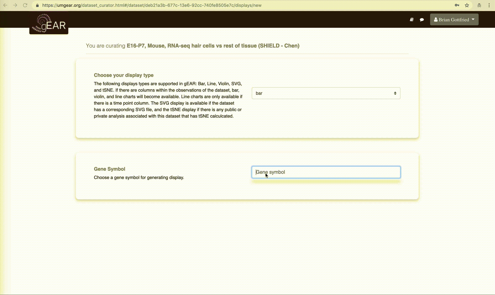

# Dataset Curator
> The dataset curator allows users to create custom displays for a dataset they own or other public datasets of interest. A user can create one or more displays for others to toggle or set as their default display when searching genes.

## Getting Started
To create a display, first click on the **Add Display** panel.

After clicking **Add Display**, you will begin the process of curating your dataset. This process includes choosing:
- Display type
- Gene symbol
- Grouping
- Ordering
- Colors
- Display name

Our example below will demonstrate curating a bar display.

## Choosing display type
Currently the gEAR supports visualizations such as bar graphs, violin plots, line graphs, SVG, and tSNE. Different display types are available to display based on different criteria. For example, line plots are only available if your dataset contains the column labeled as time_point in its observation metadata. The SVG option is available if there is a corresponding SVG for your dataset, and tSNE if there is a saved analysis from the Single Cell RNA-Seq Workbench.

To see what display types are available, click on the selection box:

## Gene Symbol
In order to get a sense of your data and the chosen display type, we need to choose a gene symbol. This gene symbol will determined what is displayed in the curator dashboard.

## Grouping
This display option lets you change the number of groups to display on your graph and how to group them. For example, the following is a dataset with samples obtained from two brain regions, at four time points and from both male and female animals, separately.
To group just by time point, for example, we can select 1 for the number of groups and time point for the group by option. This will aggregate the data and display time_point across the x-axis. Click the preview chart button to preview the display.

However, if you want to show condition, gender, and time_point you can select 3 groups and place these variables into the group by drop-down  menus.

## Ordering
Sometimes, a dataset’s time_point column represents ordinal categorical values, however, gEAR may not know how to order these values.  The ordering panel allows you to adjust this order, including the order of other columns such as condition and gender. To change the order, simply click and drag the purple boxes into the order you want them.
For example, the time points above are not in the correct order (ADULT, P14, P21, P7). We can fix this by simply dragging the labels to the correct order and clicking Reorder.

## Coloring
Allows you to change the colors of the different conditions on your graph. Click on the condition that you want to change colors of and select the color you want to change it to. Here we changed females to pink and males to blue.

## Naming
This will change the name of this curation of the dataset. Once you are happy with how the data is presented, change the name of your display to something representative of the visualization and press save. This will save your display and it will be accessible in the “Your Curations” panel.

Once the display is saved it will show up in your display list on the curator. At any time you can delete this display or edit it. You can also make it the default display when searching a gene in this dataset. If you save more than one display, you will be able to toggle between displays.
