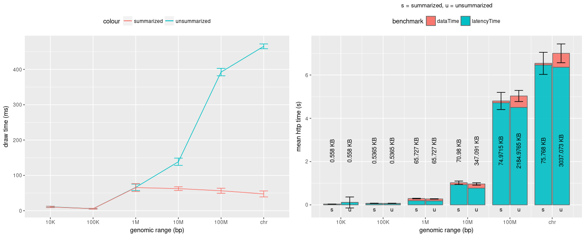

Use this script to benchmark the component library. The benchmark scripts _benchmark-bp.js_
or _benchmark-bp-scaled.js_ are run with increasing genomic sizes (10K, 100K, 1M, 100M, entire chr). The default number of runs for each genomic range is 10.

### Setup

Install the Google Chrome puppeteer tool either through npm or yarn package manager

```
npm install puppeteer
# or
yarn add puppeteer
```

### Run Benchmarks

The html pages for benchmarks are in tests/ directory.

to run the benchmarks

```
node benchmarks-bp.js > results/scaled.png
```

If the screenshots are enabled for benchmarks, they are available in screenshots/ directory.

### Plot data

The R script _benchmarks-plot.R_ can be used to generate the plot for draw times, http response times and network latency.

The data for the current iteration of the benchmarks is plotted below -

</img>
